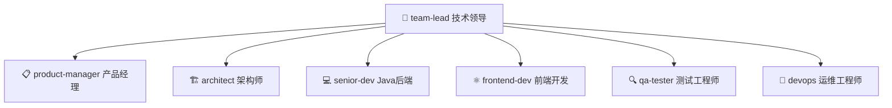

# Blog Platform — 多 Agent 协作开发的博客系统

一个由 **7 人虚拟 Agent 研发团队**通过 7 阶段交付流水线协作开发的个人博客平台，采用 DDD 四层架构，从需求分析到部署上线全流程由 AI Agent 驱动。

---

## ✨ 亮点

> **这不是一个普通的博客项目，它展示了 AI Agent 团队协作开发的完整范式。**

> ⚠️ **重要说明**：受限于当前 Agent 平台的生命周期机制，本项目中的"多 Agent 协作"并非真正的 7 个独立 AI 实例并行开发。实际运作模式为**单 Agent 扮演多角色**——Team Lead 同时承担产品经理、架构师、开发、测试、运维等全部角色，按角色定义和流水线规范顺序推进。Agent 团队配置 (`agent-team/roles/`) 提供的是流程框架、角色分工标准和质量规范，而非独立的 AI 开发人员。

- 🤖 **多 Agent 协作**：产品经理、架构师、前后端开发、测试、运维共 7 个角色分工协作
- 🔄 **智能流水线**：复杂度评估 → 需求评审 → 技术方案 → 代码实现 → 测试验证 → 部署上线 → 交付产品 → 知识回写
- 🏗️ **DDD 四层架构**：domain / application / infrastructure / interfaces，含代码审查和架构合规检查
- 🛡️ **自动化质量门禁**：5 道检查点（Lint → Build → Test → Browser → Health），不通过自动阻断
- 📚 **自学习知识库**：每次任务自动注入历史陷阱，完成后回写新发现（含 DDD 架构陷阱）
- 📋 **完整交付文档**：两轮迭代共 20+ 份文档，覆盖初始开发和 DDD 重构
- 🚀 **一键部署**：PowerShell 脚本 + Docker Compose，含健康检查和自动回滚

---

## 🛠 技术栈

| 层面 | 技术 | 说明 |
|------|------|------|
| **读者端** | Vue 3 + TypeScript + Vite | SPA，含 Markdown 渲染（marked + github-markdown-css） |
| **管理后台** | Vue 3 + TypeScript + Vite + Element Plus | 文章管理、评论审核、分类标签、用户管理 |
| **后端** | Spring Boot 2.7 + MyBatis Plus + DDD | 四层架构，含 Knife4j 文档 |
| **缓存** | Redis | 文章详情/列表缓存（Cache-Aside），TTL 30min |
| **数据库** | MySQL 8 | 文章、评论、用户、分类、标签、版本快照 |
| **反向代理** | Nginx | 前端静态资源 + API 代理 |
| **容器化** | Docker Compose | 全栈一键部署 |
| **任务编排** | n8n | 自动化工作流（可选） |

---

## 📁 项目结构

```
study/                                  # 工作区根目录
├── blog-platform/                      # 前端项目
│   ├── blog-frontend/                  # 读者端 (Vue 3 + marked + TypeScript)
│   └── blog-admin/                     # 管理后台 (Vue 3 + Element Plus + TypeScript)
├── blog-server/                        # 后端 (Spring Boot + DDD 四层架构)
│   └── src/main/java/com/blog/
│       ├── article/                    # Bounded Context: 文章
│       │   ├── domain/                 # 聚合根 + 值对象 + Repository 接口
│       │   ├── application/            # ApplicationService + ReadService
│       │   ├── infrastructure/         # PO + Mapper + RepositoryImpl
│       │   └── interfaces/             # Controller (Admin + Tag + Category + Search)
│       ├── user/                       # Bounded Context: 用户
│       ├── comment/                    # Bounded Context: 评论
│       ├── shared/                     # 跨 Context 共享 (Result/AuthContext/DomainException)
│       └── config/                     # Spring 配置
├── nginx/                              # Nginx 反向代理配置
├── docker-compose.yml                  # Docker Compose 全栈部署
├── deploy.ps1 / deploy-ddd.ps1         # 一键部署脚本（PowerShell）
├── build-and-deploy.bat                # 精简部署脚本（CMD）
├── docs/
│   ├── api-contract-v2.md              # 🆕 API 契约 v2.0（33 接口）
│   ├── test-report-api-fix.md          # API 修复测试报告
│   ├── blog/                           # 初始版本交付文档（10 份）
│   └── ddd-refactor/                   # DDD 重构交付文档 + 代码审查报告
├── agent-team/                         # 🤖 Agent 研发团队配置 (v4)
│   ├── roles/                          # 7 个角色 Prompt 定义
│   ├── workflows/                      # 7 阶段流水线 + 复杂度评估
│   ├── protocols/                      # 通讯协议 + 质量门禁
│   ├── knowledge/                      # 共享知识库（context + learned-lessons）
│   ├── scripts/                        # 质量门禁自动化脚本
│   └── team-config.yml                 # 团队总控配置
└── workflow/                           # n8n 工作流 + 本机部署方案
```

---

## 🤖 多 Agent 协作开发

> ⚠️ **坦诚说明**：受限于 Agent 平台生命周期（Agent 不跨 session 存活），实际运作模式为 **单 Agent 扮演多角色**。本配置提供的是流程框架和分工规范，而非真正的多 AI 实例并行开发。详见 `agent-team/team-config.yml` 顶部说明。

本项目展示了一个完整的 **AI Agent 研发团队**如何通过定义角色、流水线和通讯协议，实现从需求到上线的全流程协作。

### 团队阵容



| 角色 | 职责 | 产出 |
|------|------|------|
| **team-lead** 👑 | 接收任务、协调团队、把控全局 | 交付报告 + 知识沉淀 |
| **product-manager** 📋 | 需求评审、PRD 编写 | 需求评估报告 |
| **architect** 🏗️ | 技术方案、架构设计 | 架构文档 + 接口文档 + 数据库设计 |
| **senior-dev** 💻 | Java 后端开发 | 后端代码 + 单元测试 |
| **frontend-dev** ⚛️ | Vue 前端开发 | 前端代码 + 组件封装 |
| **qa-tester** 🔍 | 测试验证 | 测试报告 + Bug 清单 |
| **devops** 🚀 | 部署上线 | 上线方案 + 部署确认 |

### 交付流水线

```
你的需求 → team-lead 接收
              │
              ├─→ ⓪ 复杂度评估（Tiny/Small/Medium/Large/XLarge）
              │     Tiny → 跳过①②，直接③④⑤
              ├─→ ① product-manager：需求评审 ──→ 通知 ✅
              ├─→ ② architect：技术方案 + API 契约 ──→ 通知 ✅
              ├─→ ③ 代码实现（前后端并行）
              │     ├── senior-dev：后端（DDD 四层）
              │     └── frontend-dev：前端（Vue 3 + TS）
              │         ──→ 通知 ✅
              ├─→ ④ qa-tester：质量验证 ──→ 通知 ✅
              │     └── Bug → 打回③ → 修复 → 重测 → 循环直到通过
              ├─→ ⑤ devops：部署上线 + 健康检查 ──→ 通知 ✅
              ├─→ ⑥ team-lead：交付报告 + 知识沉淀文档 ──→ 通知 ✅
              └─→ ⑦ 知识回写：learned-lessons + context 更新
```

### 交付物清单

**初始版本** (`docs/blog/`)：
```
├── 01-需求评估报告.md          (product-manager)
├── 02-架构设计文档.md          (architect)
├── 03-前端接口文档.md          (architect)
├── 04-后端自检报告.md          (senior-dev)
├── 05-前端自检报告.md          (frontend-dev)
├── 06-测试报告.md             (qa-tester)
├── 07-上线方案.md             (devops)
├── 08-上线报告.md             (devops)
├── 09-交付报告.md             (team-lead)
├── 10-知识沉淀文档.md          (team-lead)
└── ddl/blog-ddl.sql           (senior-dev)
```

**DDD 重构** (`docs/ddd-refactor/`)：
```
├── 02-架构设计文档.md          (architect)
├── 08-上线报告.md             (devops)
├── 09-交付报告.md             (team-lead) 🆕
├── 10-知识沉淀文档.md          (team-lead) 🆕
└── code-review-report.md      (code-reviewer) 🆕
```

**契约 + 测试** (`docs/`)：
```
├── api-contract-v2.md          (architect)    33 接口全量契约
└── test-report-api-fix.md      (team-lead)    修复验证测试
```

---

## 🔧 如何使用 agent-team

### 前置条件

在 CodeBuddy 中打开本项目，`agent-team/` 目录下的配置会被自动识别。你只需跟 Team Lead 对话即可驱动整个团队。

### 使用方式

直接向我（Team Lead）描述你的需求，例如：

```
"帮我开发一个用户管理模块，包含注册、登录、权限管理"
"给博客添加文章点赞功能"
"优化首页加载速度"
"改一下页面上的按钮颜色"         ← v4：Tiny 任务自动跳过评审阶段
```

我会自动：
1. **分析需求复杂度**（Tiny/Small/Medium/Large/XLarge），决定跳转策略
2. **注入历史经验** — 从 `knowledge/learned-lessons.md` 读取相关陷阱
3. 按需创建对应角色的 Agent
4. 按流水线推进（Tiny 任务跳过评审，直接编码）
5. 每个阶段完成时主动通知你
6. 最终交付代码 + 文档 + **回写知识库**

### 自定义配置

**调整角色行为**：编辑 `agent-team/roles/` 下对应的 `.md` 文件，修改角色的 Prompt。

**接入外部服务**：编辑 `agent-team/integrations/user-config.yml`，配置数据库、缓存、消息队列等：

```yaml
database:
  enabled: true
  type: mysql
  host: localhost
  port: 3306

cache:
  enabled: true
  type: redis

deploy:
  target: docker-compose
```

**修改流水线**：编辑 `agent-team/workflows/pipeline.md` 和 `agent-team/team-config.yml`。

**查看质量门禁**：编辑 `agent-team/protocols/quality-gates.md` 自定义检查标准。

### CI/CD 自动流水线

项目配置了 GitHub Actions，推送代码到 `master` 分支时自动执行：

```yaml
.github/workflows/ci.yml:
  前端: vue-tsc 类型检查 → npm build → 验证产物
  后端: mvn compile → mvn test → mvn package → 验证 JAR
  全部通过 → ✅ 可安全部署
```

### 独立使用

如果你想在其他项目中使用这个 Agent 团队，只需复制 `agent-team/` 目录到目标项目的 `.codebuddy/agent-team/` 下即可。

---

## 🚀 快速启动

### 方式一：一键部署脚本

```powershell
# PowerShell（推荐，含前端构建 + 后端打包 + 健康检查）
.\deploy-ddd.ps1
```

```cmd
:: CMD 精简版（仅后端构建 + 重启）
.\build-and-deploy.bat
```

### 方式二：Docker 全栈部署

```bash
docker compose up -d
```

### 方式三：本地开发

```bash
# 启动后端 + 数据库 + Redis
docker compose up -d mysql redis backend

# 读者端
cd blog-platform/blog-frontend
npm install && npm run dev

# 管理后台
cd blog-platform/blog-admin
npm install && npm run dev
```

### 服务端口

| 服务 | 地址 |
|------|------|
| 读者端 | http://localhost:3000 |
| 管理后台 | http://localhost:3000/admin/ |
| API（经 Nginx） | http://localhost:3000/api/ |
| API（直连） | http://localhost:8080/api/ |
| Knife4j 文档 | http://localhost:8080/api/doc.html |
| MySQL | localhost:3307 (root/root) |
| Redis | localhost:6380 |

### 常用运维命令

```bash
# 查看服务状态
docker compose ps

# 查看日志
docker compose logs -f backend   # 后端实时日志
docker compose logs nginx --tail=30  # Nginx 最近 30 行

# 重启服务
docker compose restart backend
docker compose restart nginx

# 停止全部
docker compose down
```

### 管理员

- 账号：**admin** / 密码：**admin123**

---

## 📜 版本历史

| 日期 | 版本 | 变更 |
|------|------|------|
| 2026-06-16 | v1.0 | 博客平台首次上线 |
| 2026-06-16 | v1.1 | Markdown 渲染修复（前端 marked） |
| 2026-06-16 | v2.0 | DDD 四层架构重构（4 Context） |
| 2026-06-17 | v2.1 | API 契约 v2 对齐 + P0 修复 + 文档清理 |

---

## 📄 License

MIT
