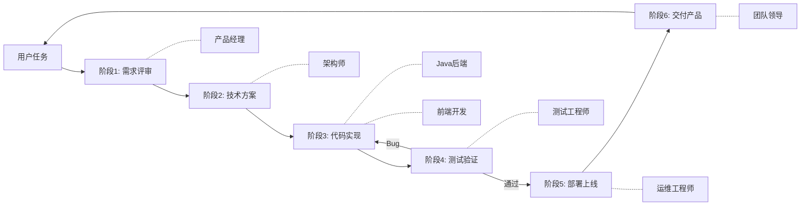

# 完整交付流水线 (Delivery Pipeline)

## 流水线总览



## 阶段详解

### 阶段 1：需求评审
```
负责人：产品经理 (product-manager)
输入：用户原始需求
产出：
  - docs/{req-name}/01-需求评估报告.md
  - 需求合理度评分
  - 功能点拆解
  - 验收标准
```

### 阶段 2：技术方案
```
负责人：架构师 (architect)
输入：PRD 文档（阶段1产出）
产出：
  - docs/{req-name}/02-架构设计文档.md
  - docs/{req-name}/03-前端接口文档.md
  - 数据库设计
  - 接口设计
  - 业务流程设计
```

### 阶段 3：代码实现（动态并行）

```
负责人（按任务量动态分配）：
  S 级 → senior-dev ×1 + frontend-dev ×1
  M 级 → senior-dev ×(1-2) + frontend-dev ×(1-2)
  L 级 → senior-dev ×(2-3) + frontend-dev ×(2-3) + 1 merger
  XL 级 → senior-dev ×(3-4) + frontend-dev ×(3-4) + 1 merger

子任务分片规则：
  - 后端：按 Controller 拆分（每个 dev 负责 2-3 个 Controller）
  - 前端：按页面拆分（每个 dev 负责 3-5 个页面）
  - 公共模块（Service/工具类/组件）由编号最小的 dev 负责

合并规则：
  - 所有子 dev 完成后通知 Team Lead
  - Team Lead 指定 merger agent 负责集成
  - merger 完成后 Team Lead 审核通过

输入：技术方案（阶段2产出）
产出：
  [后端]
  - 功能代码（Java）
  - docs/{req-name}/ddl/{req-name}-ddl.sql
  - 单元测试
  - docs/{req-name}/04-后端自检报告.md
  [前端]
  - 前端页面代码
  - docs/{req-name}/05-前端自检报告.md

后端的接口文档是前后端并行开发的核心契约，双方据此独立开发，阶段4联调测试。
```

### 阶段 4：测试验证
```
负责人：测试工程师 (qa-tester)
输入：代码 + 技术方案
产出：
  - docs/{req-name}/06-测试报告.md
  - 测试用例清单
  - 测试截图（.playwright-cli/ 目录）
  - console 错误日志
  - Bug 清单（如有）
  
循环：如果存在 Bug → 进入 Bug 修复子流水线 → 重新测试 → 直到通过
```

### Bug 修复子流水线

当阶段 4 发现 Bug 时，触发以下循环：

```
QA 输出 Bug 清单（含错误日志+截图+复现步骤）
  │
  ▼
Team Lead 判定 Bug 归属（前端/后端）
  │
  ├── 前端 Bug → 分配给 frontend-dev
  └── 后端 Bug → 分配给 senior-dev
         │
         ▼
    ┌────────────────────────────────────────────┐
    │ 开发 Agent 负责（修复 + 构建）                │
    │                                            │
    │ 1. 按排查优先级修复代码                      │
    │ 2. npm run build / mvn clean package       │
    │ 3. 确认编译通过，无 lint 错误                 │
    │ 4. 更新自检报告                             │
    │ 5. 通知 Team Lead：                          │
    │    "修复+构建完成。产物路径：{dist-or-jar-path}" │
    └────────────────────────────────────────────┘
         │
         ▼
    Team Lead 审核自检通过 →
    send_message(type="message", recipient="devops",
      content="部署任务。前端产物：{path}，后端产物：{path}，请部署。")
         │
         ▼
    ┌────────────────────────────────────────────┐
    │ 运维 Agent 负责（部署，不判断产物新旧）        │
    │                                            │
    │ 1. 使用 Team Lead 指定的产物路径直接部署       │
    │    （信任上游已构建完成，不再验证是否最新）      │
    │ 2. docker compose up -d / restart {service} │
    │ 3. curl 健康检查                            │
    │ 4. docker logs --tail=50 确认无异常          │
    │ 5. 通知 Team Lead "部署完成，服务状态：..."     │
    └────────────────────────────────────────────┘
         │
         ▼
    Team Lead → 通知 QA 重新测试
         │
         ▼
    循环直到 P0/P1 = 0 且 通过率 ≥ 95% 且 console error = 0
```

**分工说明**：

| 步骤 | 负责人 | 说明 |
|------|:------:|------|
| 修复代码 | Dev | 核心职责 |
| 编译构建（npm build / mvn package） | Dev | 自检一部分，产出可部署产物 |
| 通知交付 | Dev → TL | Dev 告知 TL 产物路径 + 构建状态 |
| 派发部署 | TL → Devops | TL 传递产物路径，不修改、不判断 |
| 正式部署（docker 重启 + 健康检查） | Devops | 信任上游产物已就绪，直接部署 |
| 回归测试 | QA | 独立第三方验证 |

**关键原则：Dev 构建，Devops 部署**。Devops 不判断产物是否最新——这由 Dev 的构建动作保证。Team Lead 只做路径中转，不替任何一方做判断。

**Bug 修复时限**：单轮修复 30 分钟内完成，超时 → 上报 Team Lead → 考虑换人或加人。

### 阶段 5：部署上线
```
负责人：运维工程师 (devops)
输入：通过测试的代码 + 技术方案
产出：
  - docs/{req-name}/07-上线方案.md
  - docs/{req-name}/08-上线报告.md
  - 监控配置
  - 回滚预案
```

### 阶段 6：交付产品
```
负责人：团队领导 (team-lead)
输入：所有阶段产出
产出：
  - docs/{req-name}/09-交付报告.md
  - docs/{req-name}/10-知识沉淀文档.md
  - 向用户做最终交付汇报
```

## 质量门禁

每个阶段必须满足以下条件才能进入下一阶段：

| 阶段 | 门禁条件 |
|------|---------|
| 需求评审 | 七维度评估完成 + 评估结论为"建议开发" |
| 技术方案 | 架构评审通过 + 接口文档完整 + 数据库设计兼容 |
| 代码实现 | 后端自检通过 + 前端自检通过 + 接口联调通过 + 单测通过 |
| 测试验证 | P0/P1 Bug = 0 + 通过率 ≥ 95% |
| 部署上线 | 上线方案通过 + 监控配置完成 + 健康检查通过 |
| 交付产品 | 所有文档齐全 + 知识沉淀完成 |
