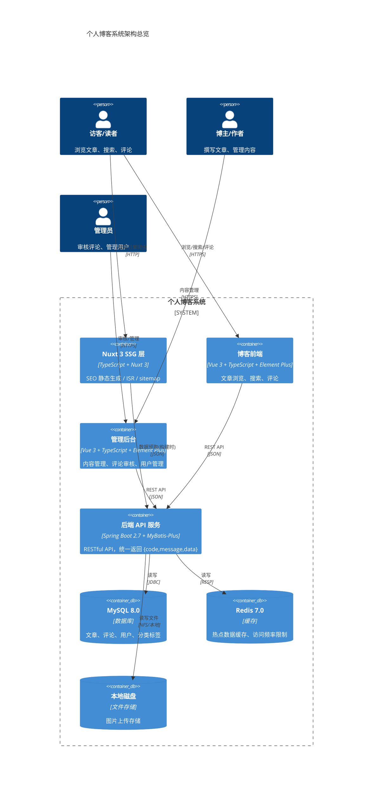
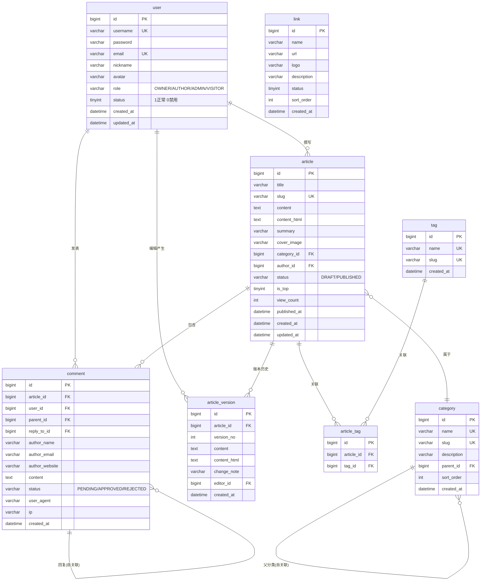
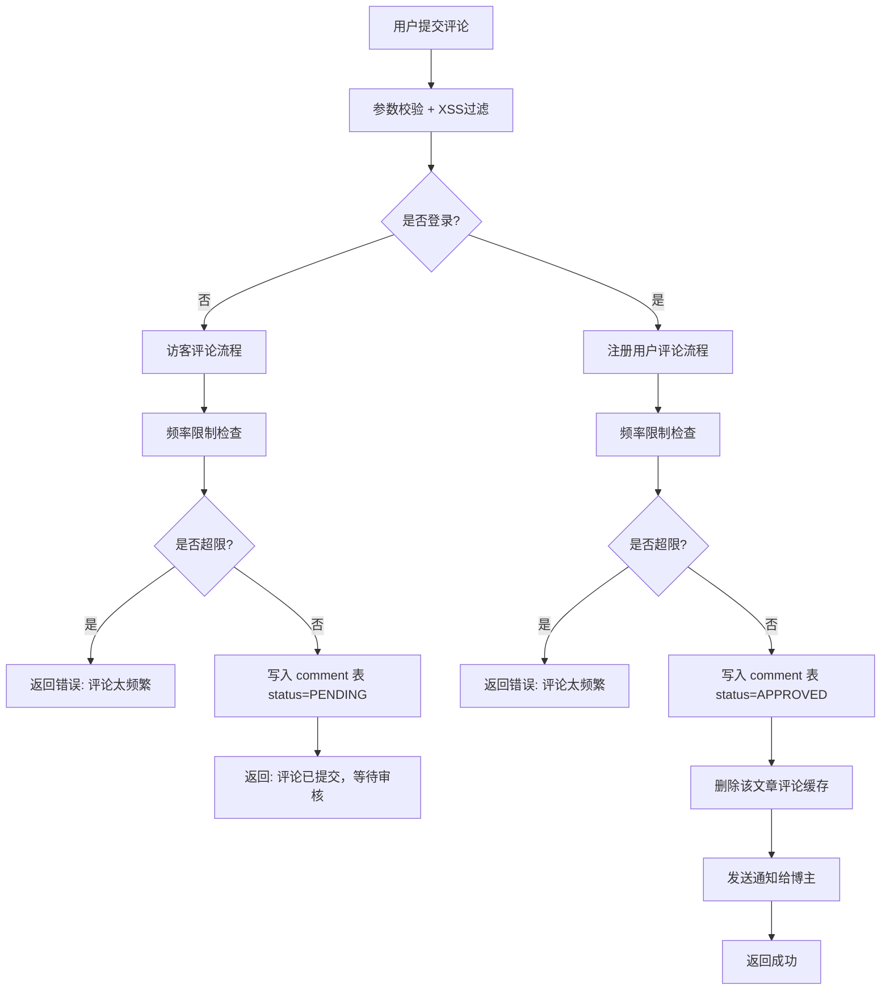
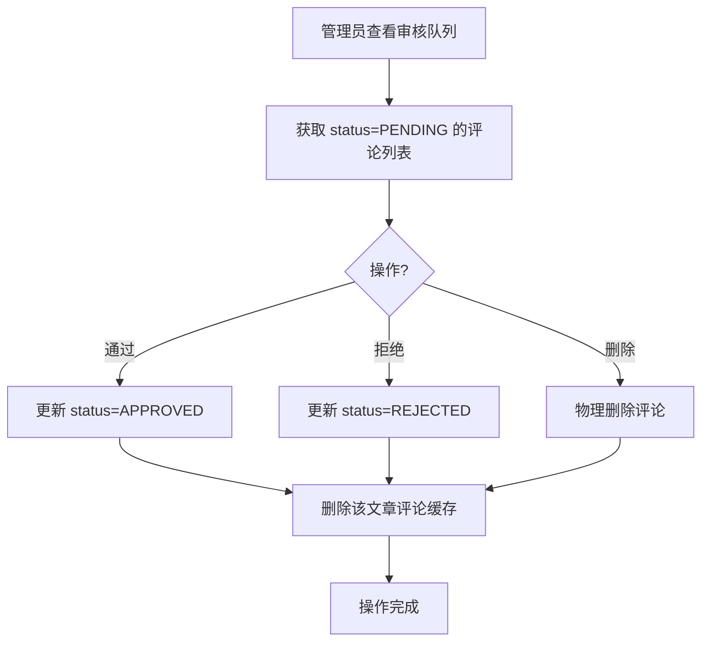

# 02-架构设计文档 — 前后端分离个人博客系统

> **需求代号**：blog  
> **设计人**：架构师 (architect)  
> **设计日期**：2026-06-12  
> **文档版本**：v1.1  
> **基于 PRD**：`01-需求评估报告.md` v1.0

---

## 一、架构总览

### 1.1 系统架构图



### 1.2 技术选型矩阵

| 层次 | 技术 | 版本 | 选型理由 |
|:-----|:-----|:-----|:--------|
| **博客前端** | Vue 3 + TypeScript + Vite | 3.x | 用户确认 Vue 3，生态成熟，Composition API |
| **管理后台** | Vue 3 + TypeScript + Vite | 3.x | 与博客前端统一技术栈，独立项目 |
| **UI 组件库** | Element Plus | 2.x | Vue 3 生态首选，组件丰富、文档完善 |
| **状态管理** | Pinia | 2.x | Vue 3 官方推荐，TypeScript 友好 |
| **路由** | Vue Router 4 | 4.x | Vue 3 官方路由方案 |
| **SSG 层** | Nuxt 3 SSG | 3.x | 用户确认选型，Vue 3 原生支持，可共享组件 |
| **后端框架** | Spring Boot | 2.7.x | 成熟稳定，团队熟悉 |
| **ORM** | MyBatis-Plus | 3.5.x | 简化 CRUD，Lambda 查询，分页插件 |
| **数据库** | MySQL | 8.0 | FULLTEXT 全文索引、窗口函数 |
| **缓存** | Redis | 7.0 | 热点缓存、频率限制、分布式锁 |
| **Markdown** | ByteMD (Vue 3 版) | 1.x | 用户确认，Vue 3 原生支持，SFC 组件 |
| **搜索** | MySQL FULLTEXT | — | 用户确认首版方案，后续升级 ES |
| **认证** | JWT (jjwt) | 0.11.x | 无状态认证，适合前后端分离 |
| **API 文档** | Knife4j (Swagger) | 4.x | 自动生成接口文档 |
| **构建工具** | Vite | 5.x | Vue 3 官方推荐，快速 HMR |
| **图片存储** | 本地磁盘 | — | 用户确认，P1 可选接入 OSS |

### 1.3 项目结构

```
blog-platform/
├── blog-frontend/          # 博客前端 (Vue 3 + TypeScript + Vite)
│   ├── src/
│   │   ├── pages/          # 页面组件（文章列表/详情/搜索/归档）
│   │   ├── components/     # 公共组件（评论/标签云/分页）
│   │   ├── api/            # API 请求封装 (axios)
│   │   ├── stores/         # Pinia 状态管理
│   │   ├── router/         # Vue Router 路由配置
│   │   ├── types/          # TypeScript 类型定义
│   │   └── utils/          # 工具函数
│   └── vite.config.ts
│
├── blog-admin/             # 管理后台 (Vue 3 + TypeScript + Vite)
│   ├── src/
│   │   ├── pages/          # 管理页面（文章/分类/标签/评论审核/用户）
│   │   ├── components/     # ByteMD 编辑器、图片上传等
│   │   ├── api/            # API 请求封装 (axios)
│   │   ├── stores/         # Pinia 状态管理
│   │   ├── router/         # Vue Router 路由配置
│   │   ├── types/          # TypeScript 类型定义
│   │   └── utils/          # 工具函数
│   └── vite.config.ts
│
├── blog-nuxt/              # Nuxt 3 SSG 层 (Vue 3 原生支持)
│   ├── pages/              # 动态路由页面
│   ├── components/         # 可共享的 Vue 组件
│   ├── composables/        # 数据获取组合函数
│   ├── server/             # Nitro 服务端 API 代理
│   └── nuxt.config.ts
│
└── blog-server/            # Spring Boot 后端
    ├── src/main/java/com/blog/
    │   ├── controller/     # 控制器层
    │   ├── service/        # 业务逻辑层
    │   ├── mapper/         # MyBatis-Plus Mapper
    │   ├── entity/         # 实体类
    │   ├── dto/            # 数据传输对象
    │   ├── vo/             # 视图对象
    │   ├── config/         # 配置类
    │   ├── common/         # 通用类（Ret、异常、常量）
    │   └── utils/          # 工具类
    └── src/main/resources/
        ├── application.yml
        └── mapper/         # MyBatis XML
```

---

## 二、模块划分

### 2.1 后端模块架构

```mermaid
graph TB
    subgraph "表现层 Controller"
        A1[ArticleController<br/>文章接口]
        A2[CategoryController<br/>分类接口]
        A3[TagController<br/>标签接口]
        A4[CommentController<br/>评论接口]
        A5[AuthController<br/>认证接口]
        A6[UserController<br/>用户管理接口]
        A7[UploadController<br/>文件上传接口]
        A8[LinkController<br/>友链接口]
        A9[ArchiveController<br/>归档接口]
        A10[SearchController<br/>搜索接口]
    end

    subgraph "业务层 Service"
        B1[ArticleService]
        B2[CategoryService]
        B3[TagService]
        B4[CommentService]
        B5[AuthService]
        B6[UserService]
        B7[FileService]
        B8[LinkService]
        B9[SearchService]
        B10[CacheService]
    end

    subgraph "数据层 Mapper"
        C1[ArticleMapper]
        C2[CategoryMapper]
        C3[TagMapper]
        C4[CommentMapper]
        C5[UserMapper]
        C6[LinkMapper]
        C7[ArticleTagMapper]
        C8[ArticleVersionMapper]
    end

    subgraph "基础设施"
        D1[MySQL 8.0]
        D2[Redis 7.0]
        D3[本地磁盘]
    end

    A1 --> B1
    A2 --> B2
    A3 --> B3
    A4 --> B4
    A5 --> B5
    A6 --> B6
    A7 --> B7
    A8 --> B8
    A9 --> B1
    A10 --> B9

    B1 --> C1
    B1 --> C7
    B1 --> C8
    B2 --> C2
    B3 --> C3
    B4 --> C4
    B5 --> C5
    B6 --> C5
    B8 --> C6
    B9 --> C1

    B1 --> B10
    B10 --> D2
    C1 --> D1
    C2 --> D1
    C3 --> D1
    C4 --> D1
    C5 --> D1
    C6 --> D1
    C7 --> D1
    C8 --> D1
    B7 --> D3
```



### 2.2 模块职责

| 模块 | 职责 | P0/P1/P2 |
|:-----|:-----|:--------:|
| **文章模块** | 发布/编辑/删除/列表/详情/草稿管理 | P0 |
| **分类模块** | 分类 CRUD、文章关联 | P0 |
| **标签模块** | 标签 CRUD、文章关联、标签云 | P0 |
| **评论模块** | 评论提交、嵌套回复、审核队列、防刷 | P0 |
| **认证模块** | 注册/登录、JWT 签发、角色鉴权 | P0 |
| **用户模块** | 用户管理、角色管理、权限控制 | P1 |
| **搜索模块** | MySQL FULLTEXT 全文搜索、结果高亮 | P0 |
| **文件模块** | 图片上传、类型校验、路径管理 | P1 |
| **缓存模块** | Redis 缓存管理、热点数据缓存 | P1 |
| **归档模块** | 按年月归档、时间线展示 | P1 |
| **友链模块** | 友链 CRUD、前台展示 | P1 |
| **版本模块** | 文章版本历史、版本对比 | P2 |
| **统计模块** | 阅读量统计、访问统计 | P2 |

---

## 三、数据库设计

### 3.1 ER 图



### 3.2 DDL 语句

```sql
-- =============================================
-- 博客系统 DDL（MySQL 8.0）
-- =============================================
CREATE DATABASE IF NOT EXISTS `blog` DEFAULT CHARACTER SET utf8mb4 COLLATE utf8mb4_unicode_ci;
USE `blog`;

-- -----------------------------------------
-- 1. 用户表
-- -----------------------------------------
CREATE TABLE `user` (
    `id`            BIGINT          NOT NULL AUTO_INCREMENT  COMMENT '用户ID',
    `username`      VARCHAR(50)     NOT NULL                 COMMENT '用户名',
    `password`      VARCHAR(255)    NOT NULL                 COMMENT '密码(BCrypt)',
    `email`         VARCHAR(100)    DEFAULT NULL             COMMENT '邮箱',
    `nickname`      VARCHAR(50)     DEFAULT NULL             COMMENT '昵称',
    `avatar`        VARCHAR(255)    DEFAULT NULL             COMMENT '头像URL',
    `role`          VARCHAR(20)     NOT NULL DEFAULT 'VISITOR' COMMENT '角色: OWNER/AUTHOR/ADMIN/VISITOR',
    `status`        TINYINT         NOT NULL DEFAULT 1       COMMENT '状态: 1正常 0禁用',
    `created_at`    DATETIME        NOT NULL DEFAULT CURRENT_TIMESTAMP COMMENT '创建时间',
    `updated_at`    DATETIME        NOT NULL DEFAULT CURRENT_TIMESTAMP ON UPDATE CURRENT_TIMESTAMP COMMENT '更新时间',
    PRIMARY KEY (`id`),
    UNIQUE KEY `uk_username` (`username`),
    UNIQUE KEY `uk_email` (`email`),
    KEY `idx_role` (`role`),
    KEY `idx_status` (`status`)
) ENGINE=InnoDB DEFAULT CHARSET=utf8mb4 COLLATE=utf8mb4_unicode_ci COMMENT='用户表';

-- -----------------------------------------
-- 2. 分类表
-- -----------------------------------------
CREATE TABLE `category` (
    `id`            BIGINT          NOT NULL AUTO_INCREMENT  COMMENT '分类ID',
    `name`          VARCHAR(50)     NOT NULL                 COMMENT '分类名称',
    `slug`          VARCHAR(50)     NOT NULL                 COMMENT 'URL别名',
    `description`   VARCHAR(255)    DEFAULT NULL             COMMENT '分类描述',
    `parent_id`     BIGINT          DEFAULT NULL             COMMENT '父分类ID(自关联)',
    `sort_order`    INT             NOT NULL DEFAULT 0       COMMENT '排序',
    `created_at`    DATETIME        NOT NULL DEFAULT CURRENT_TIMESTAMP COMMENT '创建时间',
    PRIMARY KEY (`id`),
    UNIQUE KEY `uk_name` (`name`),
    UNIQUE KEY `uk_slug` (`slug`),
    KEY `idx_parent_id` (`parent_id`)
) ENGINE=InnoDB DEFAULT CHARSET=utf8mb4 COLLATE=utf8mb4_unicode_ci COMMENT='分类表';

-- -----------------------------------------
-- 3. 标签表
-- -----------------------------------------
CREATE TABLE `tag` (
    `id`            BIGINT          NOT NULL AUTO_INCREMENT  COMMENT '标签ID',
    `name`          VARCHAR(50)     NOT NULL                 COMMENT '标签名称',
    `slug`          VARCHAR(50)     NOT NULL                 COMMENT 'URL别名',
    `created_at`    DATETIME        NOT NULL DEFAULT CURRENT_TIMESTAMP COMMENT '创建时间',
    PRIMARY KEY (`id`),
    UNIQUE KEY `uk_name` (`name`),
    UNIQUE KEY `uk_slug` (`slug`)
) ENGINE=InnoDB DEFAULT CHARSET=utf8mb4 COLLATE=utf8mb4_unicode_ci COMMENT='标签表';

-- -----------------------------------------
-- 4. 文章表
-- -----------------------------------------
CREATE TABLE `article` (
    `id`            BIGINT          NOT NULL AUTO_INCREMENT  COMMENT '文章ID',
    `title`         VARCHAR(200)    NOT NULL                 COMMENT '文章标题',
    `slug`          VARCHAR(200)    NOT NULL                 COMMENT 'URL别名',
    `content`       MEDIUMTEXT      NOT NULL                 COMMENT 'Markdown原文',
    `content_html`  MEDIUMTEXT      NOT NULL                 COMMENT '渲染后HTML',
    `summary`       VARCHAR(500)    DEFAULT NULL             COMMENT '文章摘要',
    `cover_image`   VARCHAR(255)    DEFAULT NULL             COMMENT '封面图URL',
    `category_id`   BIGINT          DEFAULT NULL             COMMENT '分类ID',
    `author_id`     BIGINT          NOT NULL                 COMMENT '作者ID',
    `status`        VARCHAR(20)     NOT NULL DEFAULT 'DRAFT' COMMENT '状态: DRAFT/PUBLISHED',
    `is_top`        TINYINT         NOT NULL DEFAULT 0       COMMENT '是否置顶: 1是 0否',
    `view_count`    INT             NOT NULL DEFAULT 0       COMMENT '阅读量',
    `published_at`  DATETIME        DEFAULT NULL             COMMENT '发布时间',
    `created_at`    DATETIME        NOT NULL DEFAULT CURRENT_TIMESTAMP COMMENT '创建时间',
    `updated_at`    DATETIME        NOT NULL DEFAULT CURRENT_TIMESTAMP ON UPDATE CURRENT_TIMESTAMP COMMENT '更新时间',
    PRIMARY KEY (`id`),
    UNIQUE KEY `uk_slug` (`slug`),
    KEY `idx_category_id` (`category_id`),
    KEY `idx_author_id` (`author_id`),
    KEY `idx_status_published_at` (`status`, `published_at`),
    KEY `idx_is_top_published_at` (`is_top`, `published_at`),
    KEY `idx_view_count` (`view_count`),
    FULLTEXT KEY `ft_title_content` (`title`, `content`)
) ENGINE=InnoDB DEFAULT CHARSET=utf8mb4 COLLATE=utf8mb4_unicode_ci COMMENT='文章表';

-- -----------------------------------------
-- 5. 文章-标签关联表
-- -----------------------------------------
CREATE TABLE `article_tag` (
    `id`            BIGINT          NOT NULL AUTO_INCREMENT  COMMENT '关联ID',
    `article_id`    BIGINT          NOT NULL                 COMMENT '文章ID',
    `tag_id`        BIGINT          NOT NULL                 COMMENT '标签ID',
    PRIMARY KEY (`id`),
    UNIQUE KEY `uk_article_tag` (`article_id`, `tag_id`),
    KEY `idx_tag_id` (`tag_id`)
) ENGINE=InnoDB DEFAULT CHARSET=utf8mb4 COLLATE=utf8mb4_unicode_ci COMMENT='文章标签关联表';

-- -----------------------------------------
-- 6. 评论表
-- -----------------------------------------
CREATE TABLE `comment` (
    `id`              BIGINT        NOT NULL AUTO_INCREMENT  COMMENT '评论ID',
    `article_id`      BIGINT        NOT NULL                 COMMENT '文章ID',
    `user_id`         BIGINT        DEFAULT NULL             COMMENT '用户ID(注册用户)',
    `parent_id`       BIGINT        DEFAULT NULL             COMMENT '父评论ID(嵌套回复)',
    `reply_to_id`     BIGINT        DEFAULT NULL             COMMENT '回复目标评论ID',
    `author_name`     VARCHAR(50)   NOT NULL                 COMMENT '评论者名称',
    `author_email`    VARCHAR(100)  DEFAULT NULL             COMMENT '评论者邮箱',
    `author_website`  VARCHAR(255)  DEFAULT NULL             COMMENT '评论者网站',
    `content`         TEXT          NOT NULL                 COMMENT '评论内容(纯文本)',
    `status`          VARCHAR(20)   NOT NULL DEFAULT 'PENDING' COMMENT '状态: PENDING/APPROVED/REJECTED',
    `user_agent`      VARCHAR(500)  DEFAULT NULL             COMMENT '浏览器UA',
    `ip`              VARCHAR(45)   DEFAULT NULL             COMMENT 'IP地址',
    `created_at`      DATETIME      NOT NULL DEFAULT CURRENT_TIMESTAMP COMMENT '创建时间',
    PRIMARY KEY (`id`),
    KEY `idx_article_id_status` (`article_id`, `status`),
    KEY `idx_parent_id` (`parent_id`),
    KEY `idx_status` (`status`),
    KEY `idx_created_at` (`created_at`),
    KEY `idx_ip` (`ip`)
) ENGINE=InnoDB DEFAULT CHARSET=utf8mb4 COLLATE=utf8mb4_unicode_ci COMMENT='评论表';

-- -----------------------------------------
-- 7. 文章版本历史表 (P2)
-- -----------------------------------------
CREATE TABLE `article_version` (
    `id`            BIGINT          NOT NULL AUTO_INCREMENT  COMMENT '版本ID',
    `article_id`    BIGINT          NOT NULL                 COMMENT '文章ID',
    `version_no`    INT             NOT NULL                 COMMENT '版本号',
    `content`       MEDIUMTEXT      NOT NULL                 COMMENT 'Markdown原文快照',
    `content_html`  MEDIUMTEXT      NOT NULL                 COMMENT '渲染后HTML快照',
    `change_note`   VARCHAR(255)    DEFAULT NULL             COMMENT '变更说明',
    `editor_id`     BIGINT          NOT NULL                 COMMENT '编辑者ID',
    `created_at`    DATETIME        NOT NULL DEFAULT CURRENT_TIMESTAMP COMMENT '创建时间',
    PRIMARY KEY (`id`),
    UNIQUE KEY `uk_article_version` (`article_id`, `version_no`),
    KEY `idx_article_id` (`article_id`),
    KEY `idx_editor_id` (`editor_id`)
) ENGINE=InnoDB DEFAULT CHARSET=utf8mb4 COLLATE=utf8mb4_unicode_ci COMMENT='文章版本历史表';

-- -----------------------------------------
-- 8. 友链表 (P1)
-- -----------------------------------------
CREATE TABLE `link` (
    `id`            BIGINT          NOT NULL AUTO_INCREMENT  COMMENT '友链ID',
    `name`          VARCHAR(100)    NOT NULL                 COMMENT '网站名称',
    `url`           VARCHAR(255)    NOT NULL                 COMMENT '网站URL',
    `logo`          VARCHAR(255)    DEFAULT NULL             COMMENT 'Logo URL',
    `description`   VARCHAR(255)    DEFAULT NULL             COMMENT '描述',
    `status`        TINYINT         NOT NULL DEFAULT 1       COMMENT '状态: 1显示 0隐藏',
    `sort_order`    INT             NOT NULL DEFAULT 0       COMMENT '排序',
    `created_at`    DATETIME        NOT NULL DEFAULT CURRENT_TIMESTAMP COMMENT '创建时间',
    PRIMARY KEY (`id`),
    KEY `idx_status_sort` (`status`, `sort_order`)
) ENGINE=InnoDB DEFAULT CHARSET=utf8mb4 COLLATE=utf8mb4_unicode_ci COMMENT='友链表';
```

### 3.3 索引设计说明

| 表 | 索引名 | 类型 | 字段 | 设计意图 |
|:---|:------|:----|:-----|:--------|
| `article` | `uk_slug` | UNIQUE | `slug` | URL 唯一标识，SEO 友好 |
| `article` | `idx_status_published_at` | 联合索引 | `status, published_at` | 文章列表核心查询（已发布+时间倒序） |
| `article` | `idx_is_top_published_at` | 联合索引 | `is_top, published_at` | 置顶文章优先排序 |
| `article` | `ft_title_content` | FULLTEXT | `title, content` | 全文搜索 |
| `article` | `idx_category_id` | 普通索引 | `category_id` | 按分类筛选 |
| `article` | `idx_author_id` | 普通索引 | `author_id` | 按作者筛选 |
| `article` | `idx_view_count` | 普通索引 | `view_count` | 热门文章排序 |
| `comment` | `idx_article_id_status` | 联合索引 | `article_id, status` | 文章评论列表（已审核） |
| `comment` | `idx_parent_id` | 普通索引 | `parent_id` | 嵌套回复查询 |
| `comment` | `idx_status` | 普通索引 | `status` | 审核队列查询 |
| `comment` | `idx_ip` | 普通索引 | `ip` | 防刷检测 |
| `user` | `uk_username` | UNIQUE | `username` | 用户名唯一 |
| `user` | `uk_email` | UNIQUE | `email` | 邮箱唯一 |
| `article_tag` | `uk_article_tag` | UNIQUE | `article_id, tag_id` | 防止重复关联 |
| `article_version` | `uk_article_version` | UNIQUE | `article_id, version_no` | 版本号唯一 |
| `category` | `idx_parent_id` | 普通索引 | `parent_id` | 子分类查询 |
| `link` | `idx_status_sort` | 联合索引 | `status, sort_order` | 友链排序展示 |

---

## 四、Redis 缓存设计

### 4.1 Key 命名规范

**三位前缀规则**：`{业务域}:{实体}:{标识}`

| 前缀 | 业务域 | 说明 |
|:-----|:------|:-----|
| `blg` | blog | 博客核心业务缓存 |
| `bls` | blog-search | 搜索热词缓存 |
| `blr` | blog-rate | 频率限制 |
| `blk` | blog-lock | 分布式锁 |

### 4.2 缓存策略详情

| Key 模板 | 数据类型 | TTL | 说明 | 刷新时机 |
|:---------|:--------|:---|:-----|:--------|
| `blg:article:detail:{slug}` | String (JSON) | 30min | 文章详情缓存 | 文章更新/删除时主动删除 |
| `blg:article:list:page:{page}:size:{size}` | String (JSON) | 10min | 文章分页列表缓存 | 新文章发布/文章状态变更时删除所有 `blg:article:list:*` |
| `blg:article:list:category:{categoryId}:page:{page}` | String (JSON) | 10min | 按分类文章列表 | 分类变更时删除 `blg:article:list:category:{id}:*` |
| `blg:article:list:tag:{tagId}:page:{page}` | String (JSON) | 10min | 按标签文章列表 | 标签关联变更时删除 |
| `blg:article:hot:top{10}` | ZSet | 1h | 热门文章排行（score=阅读量） | 每 10 分钟异步刷新 |
| `blg:category:all` | String (JSON) | 1h | 全部分类列表 | 分类变更时删除 |
| `blg:tag:all` | String (JSON) | 1h | 全部标签列表 | 标签变更时删除 |
| `blg:tag:cloud` | String (JSON) | 1h | 标签云数据 | 标签关联变更时删除 |
| `blg:archive:all` | String (JSON) | 30min | 归档数据 | 文章变更时删除 |
| `blg:comment:list:{articleId}:page:{page}` | String (JSON) | 10min | 评论列表（已审核） | 新评论审核通过/删除时删除 |
| `blg:link:all` | String (JSON) | 1h | 友链列表 | 友链变更时删除 |
| `blr:comment:ip:{ip}` | String (计数) | 60s | 单 IP 评论频率限制 | 每次评论 +1，超限拒绝 |
| `blr:comment:user:{userId}` | String (计数) | 60s | 注册用户评论频率限制 | 每次评论 +1，超限拒绝 |
| `blr:login:fail:{username}` | String (计数) | 15min | 登录失败次数 | 每次失败 +1，超限锁定 15min |
| `blk:article:view:{articleId}` | String | 10s | 阅读量计数分布式锁 | 阅读量 +1 时使用 |
| `bls:search:hot` | ZSet | 24h | 热搜词 Top 20 | 每次搜索 +1 score |

### 4.3 缓存读写模式

**Cache-Aside 模式（旁路缓存）**：

```
读操作:
  1. 查询 Redis → 命中则返回
  2. 未命中 → 查询 MySQL
  3. 将结果写入 Redis，设置 TTL
  4. 返回结果

写操作:
  1. 更新 MySQL
  2. 删除 Redis 对应缓存（而非更新）
  3. 下次读取时自动重建缓存
```

**为什么删除而非更新**：在高并发场景下，更新缓存可能产生时序问题（写A→写B 但 Redis 收到 B→A 导致脏数据）。删除缓存让下次读操作自然重建，避免并发写入的竞态条件。

### 4.4 缓存穿透/击穿/雪崩防护

| 问题 | 场景 | 方案 |
|:-----|:-----|:-----|
| **缓存穿透** | 查询不存在的数据，绕过缓存直击 DB | ① 布隆过滤器预判 key 是否存在；② 空值缓存（`blg:empty:{key}`，TTL 1min） |
| **缓存击穿** | 热点 key 过期瞬间大量请求涌向 DB | ① 互斥锁（`blk:rebuild:{key}`）保证只有一个线程重建缓存；② 逻辑过期 + 异步刷新 |
| **缓存雪崩** | 大量 key 同时过期，DB 压力骤增 | ① TTL 加随机值（±20%）；② 多级缓存（本地 Caffeine + Redis）；③ 限流降级 |

---

## 五、核心业务流程设计

### 5.1 文章发布流程

```mermaid
flowchart TD
    A[博主点击发布] --> B{文章状态?}
    B -->|草稿| C[保存草稿]
    B -->|发布| D[参数校验]
    C --> C1[写入 article 表 status=DRAFT]
    C1 --> C2[返回成功]
    D --> D1{slug 是否重复?}
    D1 -->|是| D2[返回错误: slug已存在]
    D1 -->|否| E[Markdown → HTML 渲染]
    E --> F[提取摘要 summary]
    F --> G[写入 article 表 status=PUBLISHED]
    G --> H[保存文章-标签关联]
    H --> I[生成文章版本快照 v1]
    I --> J[删除缓存]
    J --> J1[删除 blg:article:list:*]
    J --> J2[删除 blg:article:detail:{slug}]
    J --> J3[删除 blg:archive:all]
    J --> K[SSG 触发重新生成]
    K --> L[返回成功]
```

### 5.2 评论提交流程（含审核）



### 5.3 评论审核流程



### 5.4 全文搜索流程

```mermaid
flowchart TD
    A[用户输入关键词] --> B[参数校验: 关键词长度≥1]
    B --> C[MySQL FULLTEXT MATCH...AGAINST 查询]
    C --> C1{IN BOOLEAN MODE}
    C1 --> D[查询 article 表<br/>MATCH(title, content) AGAINST(keyword)]
    D --> E[结果按相关度 + 发布时间排序]
    E --> F[关键词高亮处理<br/>替换为 &lt;mark&gt;标签]
    F --> G[记录搜索热词到 Redis<br/>ZINCRBY bls:search:hot 1 keyword]
    G --> H[返回分页结果]
```

### 5.5 阅读量计数（高并发优化）

```mermaid
flowchart TD
    A[用户访问文章] --> B[Redis INCR<br/>blg:article:view:daily:{articleId}:{date}]
    B --> C{计数 % 10 == 0?}
    C -->|否| D[直接返回]
    C -->|是| E[异步批量写入 MySQL]
    E --> E1[获取 Redis 中当日计数]
    E1 --> E2[UPDATE article SET view_count = view_count + N]
    E2 --> E3[更新 ZSet 热门排行]
    E3 --> D
```

**设计要点**：不每次访问都写 MySQL，每 10 次访问批量 +10，减少数据库写压力。Redis 故障时降级为直接写 MySQL。

### 5.6 SSG 增量生成流程（Nuxt 3）

```mermaid
flowchart TD
    A[文章发布/更新] --> B[后端 API 返回成功]
    B --> C[后端调用 Nuxt Webhook 或直接触发]
    C --> D[Nuxt 3 执行 nuxt generate]
    D --> E[从 API 拉取最新文章列表]
    E --> F[增量生成静态页面]
    F --> F1[生成 /article/{slug}]
    F --> F2[生成 / 首页]
    F --> F3[生成 /category/{slug}]
    F --> F4[生成 /tag/{slug}]
    F --> F5[生成 /archive]
    F --> G[更新 sitemap.xml]
    G --> H[部署静态文件到 Nginx]
```

---

## 六、高并发方案

### 6.1 场景分析

个人博客系统并发压力主要来自：
- **读多写少**：99% 流量为文章浏览，1% 为内容发布
- **搜索流量**：用户搜索行为相对集中
- **评论峰值**：热门文章可能产生评论涌入

### 6.2 分层优化策略

| 层级 | 优化手段 | 预期效果 |
|:-----|:--------|:--------|
| **Nuxt SSG 层** | 静态生成 HTML，Nginx 直接返回 | 首页/文章详情页 0 后端压力 |
| **CDN 层** | Nginx 静态资源缓存 + 图片缓存 | 降低带宽消耗 |
| **网关层** | Nginx 限流 `limit_req_zone` | 防止恶意请求 |
| **缓存层** | Redis Cache-Aside + 本地 Caffeine L1 | 减少 90%+ 数据库查询 |
| **数据库层** | 读写分离（主写从读）+ 连接池 | 支撑更高并发读 |
| **应用层** | 连接池优化 (HikariCP)、异步处理 | 提高吞吐量 |

### 6.3 评论防刷方案

```
Redis 频率限制（滑动窗口）:

Lua 脚本：
local key = KEYS[1]           -- blr:comment:ip:{ip}
local limit = tonumber(ARGV[1]) -- 限制次数
local window = tonumber(ARGV[2])-- 窗口时间(秒)

local current = redis.call('GET', key)
if current and tonumber(current) >= limit then
    return 0  -- 超限
end

redis.call('INCR', key)
redis.call('EXPIRE', key, window)
return 1  -- 允许
```

配置：
- 访客：每 IP 60s 内最多 3 条评论
- 注册用户：每用户 60s 内最多 5 条评论
- 登录失败：同一用户名 15min 内最多 5 次失败

### 6.4 连接池配置建议

```yaml
spring:
  datasource:
    hikari:
      minimum-idle: 5
      maximum-pool-size: 20
      connection-timeout: 3000
      idle-timeout: 600000
      max-lifetime: 1800000
```

---

## 七、对账与补偿机制

### 7.1 阅读量对账

| 机制 | 说明 |
|:-----|:-----|
| **定时任务** | 每 5 分钟将 Redis 中累计阅读量批量写入 MySQL |
| **兜底对账** | 每日凌晨 3:00 全量对账：将 Redis 计数同步到 MySQL |
| **Redis 故障降级** | Redis 不可用时直接写 MySQL，记录日志告警 |

### 7.2 缓存一致性补偿

| 场景 | 补偿策略 |
|:-----|:--------|
| 缓存删除失败 | 依赖 TTL 过期自动恢复（最长 30min） |
| 缓存与 DB 不一致 | 写操作采用"先写 DB、后删缓存"顺序，极端情况下 TTL 兜底 |
| 缓存重建失败 | 下次请求穿透到 DB，自动重建缓存 |

### 7.3 数据一致性

| 场景 | 方案 |
|:-----|:-----|
| 文章-标签关联更新 | 事务包裹：删除旧关联 → 插入新关联，失败回滚 |
| 评论审核 | 单条 UPDATE，无分布式事务需求 |
| 用户注册 | 唯一索引防重，用户名+邮箱唯一约束 |

---

## 八、安全设计

### 8.1 防护矩阵

| 风险 | 防护措施 |
|:-----|:--------|
| XSS | ① Markdown 渲染使用 DOMPurify 过滤；② 评论内容 HTML 实体转义存储 |
| CSRF | JWT Token 通过 `Authorization: Bearer` 头传递，不依赖 Cookie |
| SQL 注入 | MyBatis-Plus 参数化查询，禁止拼接 SQL |
| 密码泄露 | BCrypt 加密存储（cost=10） |
| 越权访问 | ① JWT 中间件校验；② 作者只能编辑自己的文章；③ 管理员接口角色校验 |
| 文件上传攻击 | ① 白名单校验扩展名（jpg/png/gif/webp）；② 大小限制 5MB；③ UUID 重命名 |
| 暴力破解 | Redis 登录失败计数，15min 内失败 5 次锁定 |
| 评论垃圾 | ① 频率限制；② 审核队列；③ 敏感词过滤（可选） |

### 8.2 JWT Token 设计

```
Header: { "alg": "HS256", "typ": "JWT" }
Payload: {
  "sub": "用户ID",
  "username": "用户名",
  "role": "OWNER/AUTHOR/VISITOR",
  "iat": 签发时间,
  "exp": 过期时间 (7天)
}
```

- Access Token 有效期 7 天
- 管理后台操作需要 role 为 OWNER/ADMIN/AUTHOR

---

## 九、部署架构

### 9.1 部署拓扑（IP 直连方案）

```
┌─────────────────────────────────────────────────┐
│                    服务器 (IP 直连)                 │
│                                                   │
│  ┌──────────┐  ┌──────────┐  ┌──────────┐        │
│  │  Nginx   │  │  Nginx   │  │  Nginx   │        │
│  │  :80     │  │  :3000   │  │  :3001   │        │
│  │  博客前端  │  │  Nuxt SSG │  │  管理后台  │        │
│  │  静态文件  │  │  静态文件  │  │  静态文件  │        │
│  └──────────┘  └──────────┘  └──────────┘        │
│                                                   │
│  ┌──────────────────────┐  ┌──────────┐          │
│  │   Spring Boot :8080  │  │  MySQL   │          │
│  │   后端 API 服务        │  │  :3306   │          │
│  └──────────────────────┘  └──────────┘          │
│                                                   │
│  ┌──────────┐  ┌────────────────┐                │
│  │  Redis   │  │  本地磁盘存储     │                │
│  │  :6379   │  │  /data/blog/img │                │
│  └──────────┘  └────────────────┘                │
└─────────────────────────────────────────────────┘
```

### 9.2 图片存储路径规范

```
/data/blog/img/{yyyy}/{MM}/{dd}/{uuid}.{ext}

示例：
/data/blog/img/2026/06/12/a1b2c3d4-e5f6-7890-abcd-ef1234567890.jpg
```

- 按日期分目录，避免单目录文件过多
- UUID 命名防止文件名冲突和路径遍历攻击
- Nginx 配置 `/img/` 路径映射到 `/data/blog/img/`

### 9.3 Nginx 关键配置

```nginx
server {
    listen 80;
    server_name _;  # IP 访问，不绑定域名

    # 博客前端
    location / {
        root /opt/blog/blog-frontend/dist;
        index index.html;
        try_files $uri $uri/ /index.html;
    }

    # 管理后台
    location /admin {
        alias /opt/blog/blog-admin/dist;
        index index.html;
        try_files $uri $uri/ /admin/index.html;
    }

    # SSG 静态页面
    location /ssg {
        alias /opt/blog/blog-nuxt/.output/public;
    }

    # 图片资源
    location /img/ {
        alias /data/blog/img/;
        expires 30d;
        add_header Cache-Control "public, immutable";
    }

    # API 代理
    location /api/ {
        proxy_pass http://127.0.0.1:8080;
        proxy_set_header Host $host;
        proxy_set_header X-Real-IP $remote_addr;
        proxy_set_header X-Forwarded-For $proxy_add_x_forwarded_for;
    }
}
```

---

## 十、影响范围分析

### 10.1 变更影响矩阵

| 模块 | 依赖方 | 变更影响 |
|:-----|:------|:--------|
| 文章表结构 | 前端文章展示、搜索、归档 | DDL 变更需同步更新 API 接口 |
| 评论审核规则 | 前端评论组件、管理后台审核页 | 审核状态枚举变更需前后端同步 |
| 缓存 Key 命名 | 所有使用 Redis 的模块 | 命名规范变更需全量刷新缓存 |
| 图片存储路径 | 前端图片展示、Markdown 编辑器 | 路径规则变更需迁移历史图片 |
| JWT Payload | 所有需要鉴权的接口 | 字段变更需用户重新登录 |
| 全文索引 | 搜索模块 | 索引重建期间搜索不可用（秒级） |

### 10.2 扩展预留

| 预留点 | 当前设计 | 扩展方向 |
|:------|:--------|:--------|
| 搜索引擎 | MySQL FULLTEXT → 抽象 SearchService 接口 | 替换为 Elasticsearch / MeiliSearch |
| 图片存储 | 本地磁盘 → 抽象 FileService 接口 | 接入 OSS / MinIO |
| 多用户 | user.role 字段支持枚举扩展 | RBAC 权限表扩展 |
| 缓存 | Redis 单机 | Redis Cluster / Sentinel |
| 数据库 | MySQL 单机 | 读写分离 / 分库分表 |

---

## 十一、技术风险与缓解

| 编号 | 风险 | 等级 | 缓解措施 |
|:-----|:-----|:----:|:--------|
| R01 | 前后端分离联调成本 | 🟢 低 | 架构阶段产出完整接口文档（Knife4j），前端基于文档开发 |
| R02 | MySQL FULLTEXT 中文分词效果差 | 🟡 中 | 配置 ngram parser（MySQL 8.0 内置），后续升级 ES |
| R03 | 本地磁盘存储不可靠 | 🟡 中 | 定期备份 `/data/blog/img/`，P1 接入 OSS |
| R04 | 单机部署无高可用 | 🟢 低 | 个人博客场景可接受，后续可加 Docker Compose + 从库 |
| R05 | SSG 增量生成延迟 | 🟢 低 | Nuxt 3 原生支持 Vue 3，SSG 层与前端技术栈一致，可共享组件；文章发布后异步触发生成 |

---

> **文档结束** — 下一阶段：Java 资深开发基于本文档进行代码实现。
