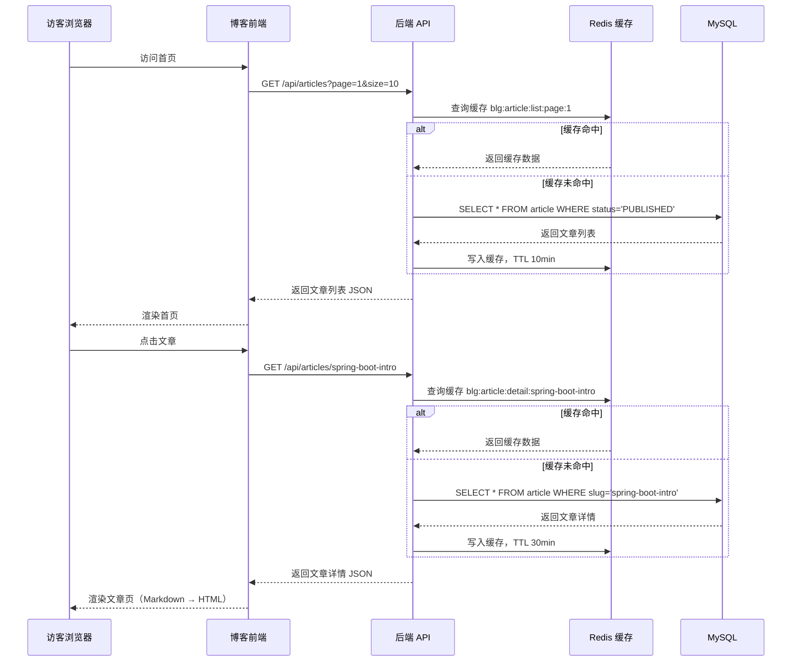
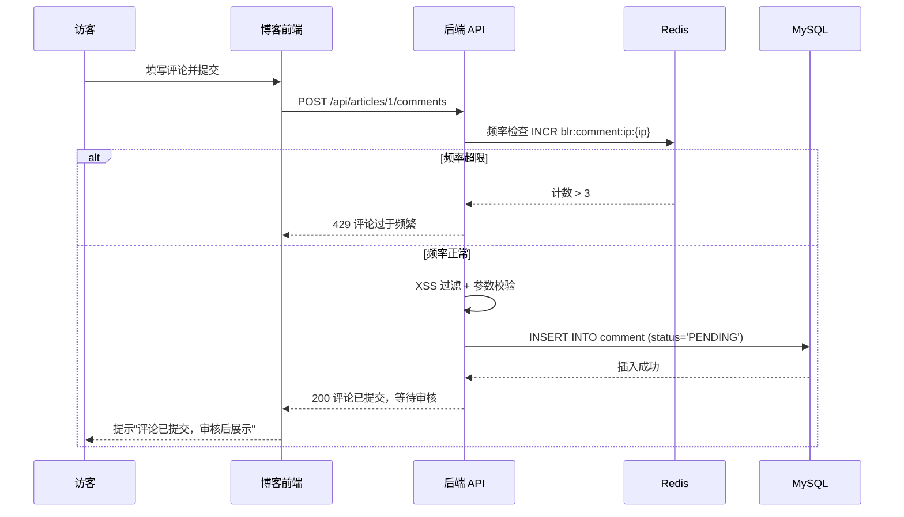
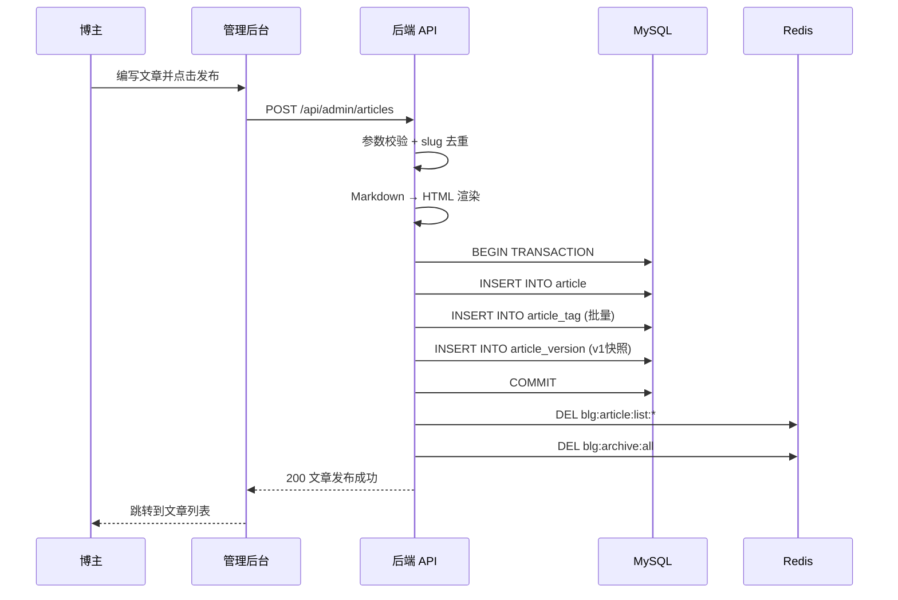
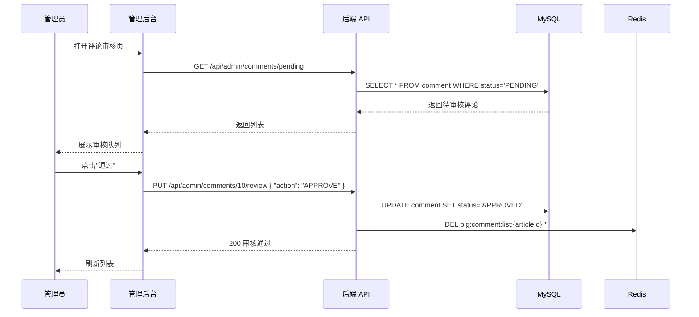

# 05-前端接口文档 — 前后端分离个人博客系统

> **需求代号**：blog  
> **设计人**：架构师 (architect)  
> **设计日期**：2026-06-12  
> **文档版本**：v1.1  
> **Base URL**：`http://{ip}:8080/api`

---

## 一、通用约定

### 1.1 统一响应格式

```json
{
  "code": 0,
  "message": "success",
  "data": {}
}
```

| 字段 | 类型 | 说明 |
|:-----|:-----|:-----|
| `code` | int | 0=成功，非0=业务错误码 |
| `message` | string | 提示信息 |
| `data` | object/array/null | 业务数据 |

### 1.2 鉴权方式

- 方式：JWT Token，通过 `Authorization: Bearer {token}` 请求头传递
- 获取：调用 `/api/auth/login` 获取 token
- 过期：7 天

### 1.3 分页请求参数（通用）

| 参数 | 类型 | 必填 | 默认值 | 说明 |
|:-----|:-----|:----:|:------:|:-----|
| `page` | int | 否 | 1 | 页码，从 1 开始 |
| `size` | int | 否 | 10 | 每页条数，最大 50 |

### 1.4 分页响应格式（通用）

```json
{
  "code": 0,
  "message": "success",
  "data": {
    "records": [],
    "total": 100,
    "page": 1,
    "size": 10,
    "pages": 10
  }
}
```

### 1.5 通用错误码

| code | message | 说明 |
|:----:|:--------|:-----|
| 0 | success | 成功 |
| 400 | Bad Request | 请求参数错误 |
| 401 | Unauthorized | 未登录或 Token 过期 |
| 403 | Forbidden | 权限不足 |
| 404 | Not Found | 资源不存在 |
| 409 | Conflict | 资源冲突（如 slug 重复） |
| 429 | Too Many Requests | 请求频率超限 |
| 500 | Internal Server Error | 服务器内部错误 |

---

## 二、接口概览

| 序号 | 接口名称 | 方法 | URL | 鉴权 | P 级别 |
|:----:|:---------|:----:|:----|:----:|:------:|
| 01 | 用户注册 | POST | `/api/auth/register` | 否 | P0 |
| 02 | 用户登录 | POST | `/api/auth/login` | 否 | P0 |
| 03 | 文章列表（公开） | GET | `/api/articles` | 否 | P0 |
| 04 | 文章详情（公开） | GET | `/api/articles/{slug}` | 否 | P0 |
| 05 | 文章管理 CRUD | GET/POST/PUT/DELETE | `/api/admin/articles` | 是 | P0 |
| 06 | 分类与标签管理 | GET/POST/PUT/DELETE | `/api/admin/categories` `/api/admin/tags` | 是 | P0 |
| 07 | 评论提交与列表 | GET/POST | `/api/comments` | 部分 | P0 |
| 08 | 评论审核管理 | GET/PUT | `/api/admin/comments` | 是 | P0 |
| 09 | 全文搜索 | GET | `/api/search` | 否 | P0 |
| 10 | 文件上传 | POST | `/api/upload/image` | 是 | P1 |

---

## 三、接口详细说明

### 接口 01：用户注册

> **POST** `/api/auth/register`

**请求参数 (JSON Body)**：

| 参数 | 类型 | 必填 | 说明 |
|:-----|:-----|:----:|:-----|
| `username` | string | 是 | 用户名，4-20 字符，字母开头 |
| `password` | string | 是 | 密码，6-30 字符 |
| `email` | string | 否 | 邮箱 |
| `nickname` | string | 否 | 昵称，默认同用户名 |

**请求示例**：

```json
{
  "username": "zhangsan",
  "password": "Abc123456",
  "email": "zhangsan@example.com",
  "nickname": "张三"
}
```

**成功响应**：

```json
{
  "code": 0,
  "message": "注册成功",
  "data": {
    "id": 1,
    "username": "zhangsan",
    "nickname": "张三",
    "role": "VISITOR",
    "createdAt": "2026-06-12T10:30:00"
  }
}
```

**错误响应**：

```json
// 用户名已存在
{ "code": 409, "message": "用户名已存在", "data": null }

// 参数校验失败
{ "code": 400, "message": "用户名长度需在4-20字符之间", "data": null }
```

---

### 接口 02：用户登录

> **POST** `/api/auth/login`

**请求参数 (JSON Body)**：

| 参数 | 类型 | 必填 | 说明 |
|:-----|:-----|:----:|:-----|
| `username` | string | 是 | 用户名 |
| `password` | string | 是 | 密码 |

**请求示例**：

```json
{
  "username": "zhangsan",
  "password": "Abc123456"
}
```

**成功响应**：

```json
{
  "code": 0,
  "message": "登录成功",
  "data": {
    "token": "eyJhbGciOiJIUzI1NiIs...",
    "user": {
      "id": 1,
      "username": "zhangsan",
      "nickname": "张三",
      "avatar": null,
      "role": "VISITOR",
      "email": "zhangsan@example.com"
    }
  }
}
```

**错误响应**：

```json
// 用户名或密码错误
{ "code": 401, "message": "用户名或密码错误", "data": null }

// 账号已禁用
{ "code": 403, "message": "账号已被禁用", "data": null }

// 登录过于频繁
{ "code": 429, "message": "登录过于频繁，请15分钟后重试", "data": null }
```

---

### 接口 03：文章列表（公开）

> **GET** `/api/articles`

**请求参数 (Query)**：

| 参数 | 类型 | 必填 | 默认值 | 说明 |
|:-----|:-----|:----:|:------:|:-----|
| `page` | int | 否 | 1 | 页码 |
| `size` | int | 否 | 10 | 每页条数 |
| `categoryId` | long | 否 | — | 按分类筛选 |
| `tagId` | long | 否 | — | 按标签筛选 |
| `keyword` | string | 否 | — | 标题模糊搜索（非全文搜索） |
| `sort` | string | 否 | `publishedAt` | 排序字段：`publishedAt` / `viewCount` |
| `order` | string | 否 | `desc` | 排序方向：`asc` / `desc` |

**请求示例**：

```
GET /api/articles?page=1&size=10&categoryId=1&sort=publishedAt&order=desc
```

**成功响应**：

```json
{
  "code": 0,
  "message": "success",
  "data": {
    "records": [
      {
        "id": 1,
        "title": "Spring Boot 入门教程",
        "slug": "spring-boot-intro",
        "summary": "这是一篇 Spring Boot 入门教程...",
        "coverImage": "/img/2026/06/12/abc.jpg",
        "category": {
          "id": 1,
          "name": "后端开发",
          "slug": "backend"
        },
        "tags": [
          { "id": 1, "name": "Java", "slug": "java" },
          { "id": 2, "name": "Spring Boot", "slug": "spring-boot" }
        ],
        "author": {
          "id": 1,
          "nickname": "博主"
        },
        "viewCount": 1280,
        "isTop": false,
        "publishedAt": "2026-06-10T08:00:00"
      }
    ],
    "total": 25,
    "page": 1,
    "size": 10,
    "pages": 3
  }
}
```

---

### 接口 04：文章详情（公开）

> **GET** `/api/articles/{slug}`

**路径参数**：

| 参数 | 类型 | 必填 | 说明 |
|:-----|:-----|:----:|:-----|
| `slug` | string | 是 | 文章 URL 别名 |

**请求示例**：

```
GET /api/articles/spring-boot-intro
```

**成功响应**：

```json
{
  "code": 0,
  "message": "success",
  "data": {
    "id": 1,
    "title": "Spring Boot 入门教程",
    "slug": "spring-boot-intro",
    "content": "# Spring Boot 入门\n\n这是一篇入门教程...",
    "contentHtml": "<h1>Spring Boot 入门</h1><p>这是一篇入门教程...</p>",
    "summary": "这是一篇 Spring Boot 入门教程...",
    "coverImage": "/img/2026/06/12/abc.jpg",
    "category": {
      "id": 1,
      "name": "后端开发",
      "slug": "backend"
    },
    "tags": [
      { "id": 1, "name": "Java", "slug": "java" },
      { "id": 2, "name": "Spring Boot", "slug": "spring-boot" }
    ],
    "author": {
      "id": 1,
      "nickname": "博主",
      "avatar": null
    },
    "viewCount": 1281,
    "isTop": false,
    "publishedAt": "2026-06-10T08:00:00",
    "createdAt": "2026-06-10T08:00:00",
    "updatedAt": "2026-06-12T10:00:00",
    "prevArticle": {
      "id": 2,
      "title": "MyBatis 配置详解",
      "slug": "mybatis-config"
    },
    "nextArticle": null
  }
}
```

**错误响应**：

```json
{ "code": 404, "message": "文章不存在", "data": null }
```

---

### 接口 05：文章管理 CRUD

#### 5.1 管理端文章列表

> **GET** `/api/admin/articles`

**鉴权**：需要登录，角色为 OWNER/ADMIN/AUTHOR

**请求参数 (Query)**：

| 参数 | 类型 | 必填 | 默认值 | 说明 |
|:-----|:-----|:----:|:------:|:-----|
| `page` | int | 否 | 1 | 页码 |
| `size` | int | 否 | 10 | 每页条数 |
| `status` | string | 否 | — | 筛选状态：`DRAFT` / `PUBLISHED` |
| `categoryId` | long | 否 | — | 按分类筛选 |

**响应数据**：同接口 03，额外包含 `status` 字段。

---

#### 5.2 创建文章

> **POST** `/api/admin/articles`

**鉴权**：需要登录，角色为 OWNER/ADMIN/AUTHOR

**请求参数 (JSON Body)**：

| 参数 | 类型 | 必填 | 说明 |
|:-----|:-----|:----:|:-----|
| `title` | string | 是 | 文章标题，1-200 字符 |
| `slug` | string | 否 | URL 别名，不传则自动从标题生成 |
| `content` | string | 是 | Markdown 原文 |
| `summary` | string | 否 | 摘要，不传则自动截取 |
| `coverImage` | string | 否 | 封面图 URL |
| `categoryId` | long | 否 | 分类 ID |
| `tagIds` | long[] | 否 | 标签 ID 数组 |
| `status` | string | 否 | `DRAFT`(默认) / `PUBLISHED` |
| `isTop` | int | 否 | 是否置顶：0(默认) / 1 |

**请求示例**：

```json
{
  "title": "Spring Boot 入门教程",
  "slug": "spring-boot-intro",
  "content": "# Spring Boot 入门\n\n这是一篇入门教程...",
  "categoryId": 1,
  "tagIds": [1, 2],
  "status": "PUBLISHED",
  "isTop": 0
}
```

**成功响应**：

```json
{
  "code": 0,
  "message": "文章发布成功",
  "data": {
    "id": 1,
    "title": "Spring Boot 入门教程",
    "slug": "spring-boot-intro",
    "status": "PUBLISHED",
    "publishedAt": "2026-06-12T13:00:00"
  }
}
```

**错误响应**：

```json
{ "code": 409, "message": "slug 已存在", "data": null }
```

---

#### 5.3 更新文章

> **PUT** `/api/admin/articles/{id}`

**鉴权**：需要登录，OWNER/ADMIN 可编辑任意文章，AUTHOR 仅可编辑自己的文章

**路径参数**：`id` — 文章 ID

**请求参数**：同创建接口，所有字段可选（只传需要更新的字段）

**成功响应**：

```json
{
  "code": 0,
  "message": "文章更新成功",
  "data": {
    "id": 1,
    "title": "Spring Boot 入门教程（修订版）",
    "updatedAt": "2026-06-12T14:00:00"
  }
}
```

**错误响应**：

```json
{ "code": 403, "message": "无权编辑此文章", "data": null }
{ "code": 404, "message": "文章不存在", "data": null }
```

---

#### 5.4 删除文章

> **DELETE** `/api/admin/articles/{id}`

**鉴权**：需要登录，OWNER/ADMIN 可删除任意文章，AUTHOR 仅可删除自己的文章

**成功响应**：

```json
{ "code": 0, "message": "删除成功", "data": null }
```

---

#### 5.5 获取文章草稿

> **GET** `/api/admin/articles/drafts`

**鉴权**：需要登录，返回当前用户的草稿列表（`status=DRAFT`）

**响应格式**：同文章列表，按 `updatedAt` 倒序。

---

### 接口 06：分类与标签管理

#### 6.1 分类列表（公开）

> **GET** `/api/categories`

**响应数据**：

```json
{
  "code": 0,
  "message": "success",
  "data": [
    {
      "id": 1,
      "name": "后端开发",
      "slug": "backend",
      "description": "后端技术文章",
      "articleCount": 15,
      "children": [
        { "id": 3, "name": "Java", "slug": "java", "articleCount": 8 }
      ]
    }
  ]
}
```

---

#### 6.2 分类 CRUD（管理端）

| 操作 | 方法 | URL | 鉴权 |
|:-----|:----:|:----|:----:|
| 创建 | POST | `/api/admin/categories` | 是 |
| 更新 | PUT | `/api/admin/categories/{id}` | 是 |
| 删除 | DELETE | `/api/admin/categories/{id}` | 是 |

**创建/更新请求参数**：

| 参数 | 类型 | 必填 | 说明 |
|:-----|:-----|:----:|:-----|
| `name` | string | 是 | 分类名称 |
| `slug` | string | 否 | URL 别名 |
| `description` | string | 否 | 描述 |
| `parentId` | long | 否 | 父分类 ID |
| `sortOrder` | int | 否 | 排序，默认 0 |

---

#### 6.3 标签列表（公开）

> **GET** `/api/tags`

**响应数据**：

```json
{
  "code": 0,
  "message": "success",
  "data": [
    { "id": 1, "name": "Java", "slug": "java", "articleCount": 12 },
    { "id": 2, "name": "Spring Boot", "slug": "spring-boot", "articleCount": 8 }
  ]
}
```

---

#### 6.4 标签云（公开）

> **GET** `/api/tags/cloud`

**响应数据**：

```json
{
  "code": 0,
  "message": "success",
  "data": [
    { "id": 1, "name": "Java", "slug": "java", "weight": 12 },
    { "id": 2, "name": "Spring Boot", "slug": "spring-boot", "weight": 8 }
  ]
}
```

> `weight` 为该标签下的文章数，前端据此计算字体大小。

---

#### 6.5 标签 CRUD（管理端）

| 操作 | 方法 | URL | 鉴权 |
|:-----|:----:|:----|:----:|
| 创建 | POST | `/api/admin/tags` | 是 |
| 更新 | PUT | `/api/admin/tags/{id}` | 是 |
| 删除 | DELETE | `/api/admin/tags/{id}` | 是 |

**创建/更新请求参数**：

| 参数 | 类型 | 必填 | 说明 |
|:-----|:-----|:----:|:-----|
| `name` | string | 是 | 标签名称 |
| `slug` | string | 否 | URL 别名 |

---

### 接口 07：评论提交与列表

#### 7.1 文章评论列表（公开）

> **GET** `/api/articles/{articleId}/comments`

**路径参数**：

| 参数 | 类型 | 必填 | 说明 |
|:-----|:-----|:----:|:-----|
| `articleId` | long | 是 | 文章 ID |

**请求参数 (Query)**：

| 参数 | 类型 | 必填 | 默认值 | 说明 |
|:-----|:-----|:----:|:------:|:-----|
| `page` | int | 否 | 1 | 页码 |
| `size` | int | 否 | 20 | 每页条数 |
| `sort` | string | 否 | `createdAt` | `createdAt`(最新) / `createdAtAsc`(最早) |

> 仅返回 `status=APPROVED` 的评论。

**成功响应**：

```json
{
  "code": 0,
  "message": "success",
  "data": {
    "records": [
      {
        "id": 10,
        "articleId": 1,
        "parentId": null,
        "authorName": "读者小明",
        "authorWebsite": "https://xiaoming.com",
        "content": "写得很好，学习了！",
        "status": "APPROVED",
        "createdAt": "2026-06-12T14:30:00",
        "children": [
          {
            "id": 11,
            "articleId": 1,
            "parentId": 10,
            "replyToId": 10,
            "authorName": "博主",
            "content": "谢谢支持！",
            "status": "APPROVED",
            "createdAt": "2026-06-12T15:00:00",
            "children": []
          }
        ]
      }
    ],
    "total": 5,
    "page": 1,
    "size": 20,
    "pages": 1
  }
}
```

> 评论嵌套结构最多返回 2 层（父评论 + 子回复），更深层通过"展开更多"按需加载。

---

#### 7.2 提交评论

> **POST** `/api/articles/{articleId}/comments`

**鉴权**：可选（登录用户关联 `userId`，访客不关联）

**请求参数 (JSON Body)**：

| 参数 | 类型 | 必填 | 说明 |
|:-----|:-----|:----:|:-----|
| `authorName` | string | 是 | 评论者名称，1-20 字符 |
| `authorEmail` | string | 否 | 邮箱 |
| `authorWebsite` | string | 否 | 个人网站 |
| `content` | string | 是 | 评论内容，1-1000 字符，纯文本 |
| `parentId` | long | 否 | 父评论 ID（嵌套回复时传入） |

**请求示例**：

```json
{
  "authorName": "读者小明",
  "authorEmail": "xiaoming@example.com",
  "content": "写得很好，学习了！",
  "parentId": null
}
```

**成功响应（访客）**：

```json
{
  "code": 0,
  "message": "评论已提交，审核通过后展示",
  "data": { "id": 10, "status": "PENDING" }
}
```

**成功响应（注册用户）**：

```json
{
  "code": 0,
  "message": "评论成功",
  "data": { "id": 10, "status": "APPROVED" }
}
```

**错误响应**：

```json
{ "code": 429, "message": "评论过于频繁，请60秒后重试", "data": null }
{ "code": 400, "message": "评论内容不能为空", "data": null }
```

---

### 接口 08：评论审核管理

#### 8.1 审核队列

> **GET** `/api/admin/comments/pending`

**鉴权**：需要登录，角色 OWNER/ADMIN

**请求参数 (Query)**：

| 参数 | 类型 | 必填 | 默认值 | 说明 |
|:-----|:-----|:----:|:------:|:-----|
| `page` | int | 否 | 1 | 页码 |
| `size` | int | 否 | 20 | 每页条数 |

**成功响应**：

```json
{
  "code": 0,
  "message": "success",
  "data": {
    "records": [
      {
        "id": 10,
        "articleId": 1,
        "articleTitle": "Spring Boot 入门教程",
        "authorName": "读者小明",
        "authorEmail": "xiaoming@example.com",
        "authorWebsite": "https://xiaoming.com",
        "content": "写得很好，学习了！",
        "status": "PENDING",
        "ip": "192.168.1.100",
        "userAgent": "Mozilla/5.0...",
        "createdAt": "2026-06-12T14:30:00"
      }
    ],
    "total": 3,
    "page": 1,
    "size": 20,
    "pages": 1
  }
}
```

---

#### 8.2 审核操作

> **PUT** `/api/admin/comments/{id}/review`

**鉴权**：需要登录，角色 OWNER/ADMIN

**请求参数 (JSON Body)**：

| 参数 | 类型 | 必填 | 说明 |
|:-----|:-----|:----:|:-----|
| `action` | string | 是 | `APPROVE` 通过 / `REJECT` 拒绝 |

**请求示例**：

```json
{ "action": "APPROVE" }
```

**成功响应**：

```json
{ "code": 0, "message": "审核通过", "data": null }
```

---

#### 8.3 删除评论

> **DELETE** `/api/admin/comments/{id}`

**鉴权**：需要登录，角色 OWNER/ADMIN

**成功响应**：

```json
{ "code": 0, "message": "删除成功", "data": null }
```

---

### 接口 09：全文搜索

> **GET** `/api/search`

**请求参数 (Query)**：

| 参数 | 类型 | 必填 | 说明 |
|:-----|:-----|:----:|:-----|
| `keyword` | string | 是 | 搜索关键词，1-100 字符 |
| `page` | int | 否 | 页码，默认 1 |
| `size` | int | 否 | 每页条数，默认 10 |

**请求示例**：

```
GET /api/search?keyword=Spring Boot&page=1&size=10
```

**成功响应**：

```json
{
  "code": 0,
  "message": "success",
  "data": {
    "records": [
      {
        "id": 1,
        "title": "Spring Boot 入门教程",
        "slug": "spring-boot-intro",
        "summary": "这是一篇 <mark>Spring</mark> <mark>Boot</mark> 入门教程...",
        "coverImage": null,
        "category": { "id": 1, "name": "后端开发", "slug": "backend" },
        "tags": [
          { "id": 1, "name": "Java", "slug": "java" }
        ],
        "author": { "id": 1, "nickname": "博主" },
        "viewCount": 1280,
        "publishedAt": "2026-06-10T08:00:00",
        "relevanceScore": 8.5
      }
    ],
    "total": 3,
    "page": 1,
    "size": 10,
    "pages": 1,
    "keyword": "Spring Boot"
  }
}
```

> `summary` 中的关键词用 `<mark>` 标签包裹，前端需支持渲染 HTML。  
> `relevanceScore` 为 MySQL FULLTEXT 的相关度分数。

**错误响应**：

```json
{ "code": 400, "message": "搜索关键词不能为空", "data": null }
```

---

### 接口 10：文件上传

> **POST** `/api/upload/image`

**鉴权**：需要登录，角色 OWNER/ADMIN/AUTHOR

**请求格式**：`multipart/form-data`

| 参数 | 类型 | 必填 | 说明 |
|:-----|:-----|:----:|:-----|
| `file` | File | 是 | 图片文件 |

**限制**：
- 允许类型：`jpg`、`jpeg`、`png`、`gif`、`webp`
- 最大大小：5MB

**请求示例**：

```
POST /api/upload/image
Content-Type: multipart/form-data

file: (binary)
```

**成功响应**：

```json
{
  "code": 0,
  "message": "上传成功",
  "data": {
    "url": "/img/2026/06/12/a1b2c3d4-e5f6-7890-abcd-ef1234567890.jpg",
    "originalName": "screenshot.png",
    "size": 102400
  }
}
```

**错误响应**：

```json
{ "code": 400, "message": "不支持的文件类型，仅允许 jpg/png/gif/webp", "data": null }
{ "code": 400, "message": "文件大小不能超过 5MB", "data": null }
```

---

## 四、接口调用时序

### 4.1 访客浏览文章



### 4.2 访客提交评论（先审后发）



### 4.3 博主发布文章



### 4.4 管理员审核评论



---

## 五、状态枚举

### 5.1 文章状态

| 枚举值 | 说明 |
|:-------|:-----|
| `DRAFT` | 草稿，仅作者可见 |
| `PUBLISHED` | 已发布，公开可见 |

### 5.2 评论状态

| 枚举值 | 说明 |
|:-------|:-----|
| `PENDING` | 待审核（访客评论初始状态） |
| `APPROVED` | 已通过，公开可见 |
| `REJECTED` | 已拒绝，不展示 |

### 5.3 用户角色

| 枚举值 | 说明 | 权限范围 |
|:-------|:-----|:--------|
| `OWNER` | 博主 | 全部权限 |
| `ADMIN` | 管理员 | 内容管理 + 评论审核 + 用户管理 |
| `AUTHOR` | 作者 | 管理自己的文章 |
| `VISITOR` | 注册访客 | 浏览 + 评论免审 |

### 5.4 用户状态

| 值 | 说明 |
|:--:|:-----|
| 0 | 禁用 |
| 1 | 正常 |

### 5.5 审核操作

| 枚举值 | 说明 |
|:-------|:-----|
| `APPROVE` | 通过 |
| `REJECT` | 拒绝 |

### 5.6 文章排序字段

| 枚举值 | 说明 |
|:-------|:-----|
| `publishedAt` | 按发布时间 |
| `viewCount` | 按阅读量 |

### 5.7 友链状态

| 值 | 说明 |
|:--:|:-----|
| 0 | 隐藏 |
| 1 | 显示 |

---

## 六、前端对接注意事项

### 6.1 技术栈

前端基于 **Vue 3 + TypeScript + Vite** 构建，推荐配套：

| 类别 | 推荐 | 说明 |
|:-----|:-----|:-----|
| UI 组件库 | Element Plus | Vue 3 生态首选，组件丰富 |
| 状态管理 | Pinia | Vue 3 官方推荐 |
| 路由 | Vue Router 4 | Vue 3 官方路由方案 |
| HTTP 客户端 | Axios | 封装请求/响应拦截器 |
| Markdown 编辑器 | ByteMD (Vue 3 版) | 管理后台文章编辑 |
| 代码高亮 | Prism.js / Shiki | 文章详情代码块渲染 |
| CSS 方案 | UnoCSS / Tailwind CSS | 原子化 CSS 快速开发 |

### 6.2 请求拦截器

前端需统一配置 Axios 请求/响应拦截器（Vue 3 项目可在 `src/api/request.ts` 中配置）：

```typescript
// request.ts — Axios 封装示例
import axios from 'axios'
import { useUserStore } from '@/stores/user'
import { ElMessage } from 'element-plus'

const request = axios.create({
  baseURL: '/api',
  timeout: 10000
})

// 请求拦截器
request.interceptors.request.use(config => {
  const userStore = useUserStore()
  if (userStore.token) {
    config.headers.Authorization = `Bearer ${userStore.token}`
  }
  return config
})

// 响应拦截器
request.interceptors.response.use(
  response => {
    const { code, message, data } = response.data
    if (code !== 0) {
      ElMessage.error(message || '请求失败')
      return Promise.reject(new Error(message))
    }
    return data
  },
  error => {
    if (error.response?.status === 401) {
      const userStore = useUserStore()
      userStore.logout()
      window.location.href = '/login'
    }
    if (error.response?.status === 429) {
      ElMessage.warning('操作过于频繁，请稍后重试')
    }
    return Promise.reject(error)
  }
)

export default request
```

### 6.3 Markdown 渲染

- 文章 `contentHtml` 字段已由后端渲染好 HTML，前端用 `v-html` 直接展示
- 需引入代码高亮库（如 Prism.js / Shiki），在 `onMounted` 中初始化
- 评论内容为纯文本，前端需做 HTML 转义后展示（使用 `v-text` 或 `{{ }}` 插值）
- 搜索结果 `summary` 中包含 `<mark>` 标签，需用 `v-html` 渲染

### 6.4 图片处理

- 管理后台 ByteMD 编辑器上传图片使用 `POST /api/upload/image`
- 返回的 `url` 为相对路径，前端拼接为完整 URL
- 建议前端做图片懒加载（`loading="lazy"` 或 `v-lazy` 指令）

### 6.5 评论嵌套

- 接口返回的 `children` 最多嵌套 2 层
- 更深层的回复通过 `parentId` 参数按需加载
- 前端需维护展开/收起状态，建议封装为递归组件

### 6.6 SEO 对接（Nuxt 3 SSG 层）

- Nuxt 3 原生支持 Vue 3，SSG 层可直接复用前端组件
- SSG 构建时调用文章列表/详情接口
- 需注意 API 地址配置（构建时 vs 运行时环境变量）
- sitemap.xml 由 Nuxt 3 `@nuxtjs/sitemap` 模块生成
- 结构化数据使用 `@nuxtjs/schema-org` 模块

---

> **文档结束** — 下一阶段：Java 资深开发基于本文档进行接口实现。
