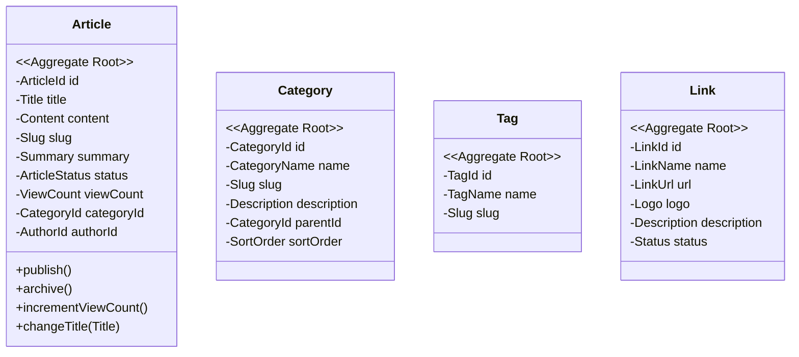

# 博客系统 DDD 重构 - 架构设计文档

> **需求**：将 blog-server 从传统三层（controller → service → mapper → entity）重构为 DDD 四层架构（interfaces → application → domain → infrastructure）。
> **目标**：不改功能、不改 API、不改数据库。前后端接口契约完全兼容。

---

## 一、限界上下文识别

### 1.1 Bounded Context 列表

| Context | 核心职责 | 类型 | 关联 Context |
|---------|---------|------|-------------|
| **article** | 文章 CRUD、分类管理、标签管理、友链管理、全文搜索、阅读量计数 | 核心域 | user（作者引用） |
| **user** | 用户注册登录、JWT 鉴权、权限控制、个人信息 | 支撑域 | — |
| **comment** | 评论提交（游客+用户）、评论审核、嵌套回复 | 核心域 | article（文章引用） |
| **upload** | 图片上传、文件存储 | 通用域 | user（鉴权） |

### 1.2 Context Map

```
┌──────────────────┐         ┌──────────────────┐
│   User           │         │   Upload         │
│   (支撑域)        │◄────────│   (通用域)        │
│   - 注册/登录     │  鉴权    │   - 图片上传      │
│   - JWT Token    │         │   - 文件存储      │
│   - 用户信息      │         └──────────────────┘
└────────┬─────────┘
         │  author_id (ID引用)
         ▼
┌──────────────────┐         ┌──────────────────┐
│   Article        │         │   Comment        │
│   (核心域)        │────────►│   (核心域)        │
│   - 文章管理      │article_id│   - 评论提交      │
│   - 分类/标签     │ (ID引用) │   - 审核管理      │
│   - 友链         │         │   - 嵌套回复      │
│   - 全文搜索      │         └──────────────────┘
│   - 阅读量统计    │
└──────────────────┘
```

**聚合间通信规则**：
- Article ↔ User：Article 只存 `author_id`，不持有 User 对象引用
- Comment ↔ Article：Comment 只存 `article_id`，不持有 Article 对象引用
- 跨 Context 查询：Application 层组合调用，不在 Domain 层跨 Context

---

## 二、领域模型

### 2.1 聚合清单

| 聚合根 | Context | 内部实体 | 值对象 | 业务不变量 |
|--------|---------|---------|--------|-----------|
| **Article** | article | — | Title, Content, Slug, ArticleStatus, ViewCount | 已发布文章不可直接改标题；删除文章需级联删版本快照 |
| **Category** | article | — | CategoryName, Slug | 删除分类前检查是否有关联文章 |
| **Tag** | article | — | TagName, Slug | 标签名唯一 |
| **Link** | article | — | — | — |
| **User** | user | — | Username, Email, Password(BCrypt), Role | 用户名/邮箱唯一；密码不可为空 |
| **Comment** | comment | — | CommentContent, CommentStatus | 只能对已发布文章评论；审核后才能公开展示 |
| **ArticleVersion** | article | — | — | 每次保存生成新版本快照 |

### 2.2 领域事件

| 事件名 | 触发时机 | 消费者 |
|--------|---------|--------|
| `ArticlePublished` | 文章状态由 DRAFT → PUBLISHED | 暂不需要跨 Context 通知 |
| `ArticleCreated` | 新文章创建 | ArticleVersion（生成初始版本快照） |
| `ArticleUpdated` | 文章内容更新 | ArticleVersion（生成新版本快照） |
| `CommentSubmitted` | 新评论提交 | 暂不需要 |
| `CommentApproved` | 评论审核通过 | 暂不需要 |

### 2.3 article 领域模型



---

## 三、分层架构设计

### 3.1 新目录结构

```
blog-server/src/main/java/com/blog/
├── article/
│   ├── domain/
│   │   ├── Article.java               # 聚合根
│   │   ├── ArticleId.java             # 值对象
│   │   ├── ArticleStatus.java         # 枚举
│   │   ├── Title.java                 # 值对象
│   │   ├── Content.java               # 值对象
│   │   ├── Slug.java                  # 值对象
│   │   ├── ViewCount.java             # 值对象
│   │   ├── Category.java              # 聚合根
│   │   ├── CategoryId.java
│   │   ├── Tag.java                   # 聚合根
│   │   ├── TagId.java
│   │   ├── Link.java                  # 聚合根
│   │   ├── ArticleVersion.java        # 实体
│   │   ├── ArticleRepository.java     # 仓储接口
│   │   ├── CategoryRepository.java
│   │   ├── TagRepository.java
│   │   ├── LinkRepository.java
│   │   ├── ArticleVersionRepository.java
│   │   ├── ArticleDomainService.java  # 领域服务
│   │   └── events/
│   │       ├── ArticleCreatedEvent.java
│   │       ├── ArticleUpdatedEvent.java
│   │       └── ArticlePublishedEvent.java
│   ├── application/
│   │   ├── ArticleApplicationService.java
│   │   ├── CategoryApplicationService.java
│   │   ├── TagApplicationService.java
│   │   ├── LinkApplicationService.java
│   │   ├── SearchApplicationService.java
│   │   ├── command/
│   │   │   ├── CreateArticleCommand.java
│   │   │   ├── UpdateArticleCommand.java
│   │   │   ├── CreateCategoryCommand.java
│   │   │   └── CreateTagCommand.java
│   │   └── query/
│   │       ├── ArticleQuery.java
│   │       ├── ArticleListView.java   # 列表查询结果
│   │       └── SearchQuery.java
│   ├── infrastructure/
│   │   ├── ArticleRepositoryImpl.java
│   │   ├── CategoryRepositoryImpl.java
│   │   ├── TagRepositoryImpl.java
│   │   ├── LinkRepositoryImpl.java
│   │   ├── ArticleVersionRepositoryImpl.java
│   │   ├── ArticlePO.java
│   │   ├── CategoryPO.java
│   │   ├── TagPO.java
│   │   ├── LinkPO.java
│   │   ├── ArticleVersionPO.java
│   │   ├── ArticleMapper.java
│   │   ├── CategoryMapper.java
│   │   ├── TagMapper.java
│   │   ├── LinkMapper.java
│   │   ├── ArticleVersionMapper.java
│   │   ├── ArticleTagMapper.java
│   │   └── converter/
│   │       ├── ArticleConverter.java
│   │       ├── CategoryConverter.java
│   │       └── TagConverter.java
│   └── interfaces/
│       ├── ArticleController.java
│       ├── AdminArticleController.java
│       ├── CategoryController.java
│       ├── TagController.java
│       ├── SearchController.java
│       └── dto/
│           ├── request/  (Request DTOs)
│           └── response/ (Response VOs)
│
├── user/
│   ├── domain/
│   │   ├── User.java
│   │   ├── UserId.java
│   │   ├── Username.java
│   │   ├── Password.java
│   │   ├── Email.java
│   │   ├── Role.java
│   │   ├── UserRepository.java
│   │   └── AuthDomainService.java
│   ├── application/
│   │   ├── AuthApplicationService.java
│   │   └── UserQueryService.java
│   ├── infrastructure/
│   │   ├── UserRepositoryImpl.java
│   │   ├── UserPO.java
│   │   ├── UserMapper.java
│   │   └── converter/UserConverter.java
│   └── interfaces/
│       ├── AuthController.java
│       └── dto/
│
├── comment/
│   ├── domain/
│   │   ├── Comment.java
│   │   ├── CommentId.java
│   │   ├── CommentContent.java
│   │   ├── CommentStatus.java
│   │   ├── CommentRepository.java
│   │   └── CommentDomainService.java
│   ├── application/
│   │   ├── CommentApplicationService.java
│   │   └── ReviewApplicationService.java
│   ├── infrastructure/
│   │   ├── CommentRepositoryImpl.java
│   │   ├── CommentPO.java
│   │   ├── CommentMapper.java
│   │   └── converter/CommentConverter.java
│   └── interfaces/
│       ├── CommentController.java
│       └── dto/
│
├── upload/
│   └── (保留简单结构，暂不完整 DDD)
│
└── shared/
    ├── BaseEntity.java
    ├── BaseValueObject.java
    ├── DomainEvent.java
    ├── DomainException.java
    ├── Result.java                    # 统一返回（原 Ret<T>）
    ├── AuthContext.java               # 当前用户上下文
    ├── PageRequest.java
    ├── PageResult.java
    ├── enums/
    │   └── ErrorCode.java
    └── utils/
        ├── JwtUtil.java
        ├── SlugUtil.java
        ├── MarkdownUtil.java
        └── XssUtil.java
```

### 3.2 DDL 变更
无变更。数据库表结构保持不变。

### 3.3 缓存设计

| Key 规则 | 类型 | TTL | 刷新 |
|---------|------|-----|------|
| `art:detail:{slug}` | String (ArticleDetailVO JSON) | 30min | 文章更新/发布时清除 |
| `art:list:{categoryId}:{page}` | String (PageResult JSON) | 10min | 新文章发布时清除 |
| `art:hot` | ZSet (viewCount) | 1h | 每次阅读+1更新 |
| `cat:all` | String (List JSON) | 1h | 分类变更时清除 |
| `tag:cloud` | String (List JSON) | 1h | 标签变更时清除 |
| `search:hot:{keyword}` | String | 10min | — |

> 缓存写在 Application 层 QueryService 中，Domain 层不感知缓存。

### 3.4 API 清单（完全兼容，不变）

| Context | 方法 | 路径 | 说明 | 鉴权 |
|---------|------|------|------|:--:|
| article | GET | /api/articles | 文章列表 | 否 |
| article | GET | /api/articles/{slug} | 文章详情 | 否 |
| article | GET | /api/admin/articles | 管理列表 | 是 |
| article | GET | /api/admin/articles/{id} | 编辑回填 | 是 |
| article | POST | /api/admin/articles | 创建 | 是 |
| article | PUT | /api/admin/articles/{id} | 更新 | 是 |
| article | DELETE | /api/admin/articles/{id} | 删除 | 是 |
| article | GET | /api/admin/articles/drafts | 草稿列表 | 是 |
| article | GET | /api/categories | 分类列表 | 否 |
| article | POST | /api/admin/categories | 创建分类 | 是 |
| article | PUT | /api/admin/categories/{id} | 更新分类 | 是 |
| article | DELETE | /api/admin/categories/{id} | 删除分类 | 是 |
| article | GET | /api/tags | 标签列表 | 否 |
| article | GET | /api/tags/cloud | 标签云 | 否 |
| article | POST | /api/admin/tags | 创建标签 | 是 |
| article | PUT | /api/admin/tags/{id} | 更新标签 | 是 |
| article | DELETE | /api/admin/tags/{id} | 删除标签 | 是 |
| article | GET | /api/search | 搜索 | 否 |
| article | GET | /api/search/hot | 热词 | 否 |
| user | POST | /api/auth/register | 注册 | 否 |
| user | POST | /api/auth/login | 登录 | 否 |
| user | GET | /api/auth/me | 当前用户 | 是 |
| comment | GET | /api/articles/{id}/comments | 文章评论 | 否 |
| comment | POST | /api/articles/{id}/comments | 提交评论 | 否 |
| comment | GET | /api/admin/comments/pending | 待审核 | 是 |
| comment | PUT | /api/admin/comments/{id}/review | 审核 | 是 |
| comment | DELETE | /api/admin/comments/{id} | 删除 | 是 |
| upload | POST | /api/upload/image | 上传图片 | 是 |

### 3.5 文件清单（预估）

| 文件 | 层 | 操作 | Context |
|------|----|------|---------|
| **article context** (约 40 文件) |
| article/domain/Article.java | domain | 新增 | article |
| article/domain/Category.java | domain | 新增 | article |
| article/domain/Tag.java | domain | 新增 | article |
| article/domain/Link.java | domain | 新增 | article |
| article/domain/ArticleVersion.java | domain | 新增 | article |
| article/domain/*Repository.java (5个) | domain | 新增 | article |
| article/domain/*Event.java (3个) | domain | 新增 | article |
| article/domain/ArticleDomainService.java | domain | 新增 | article |
| article/application/*ApplicationService.java (5个) | application | 新增 | article |
| article/application/command/ | application | 新增 | article |
| article/application/query/ | application | 新增 | article |
| article/infrastructure/*RepositoryImpl.java (5个) | infrastructure | 新增 | article |
| article/infrastructure/*PO.java (6个) | infrastructure | 新增 | article |
| article/infrastructure/*Mapper.java (6个) | infrastructure | 移动 | article |
| article/infrastructure/converter/ | infrastructure | 新增 | article |
| article/interfaces/*Controller.java (6个) | interfaces | 移动 | article |
| article/interfaces/dto/ | interfaces | 移动 | article |
| **user context** (约 10 文件) |
| user/domain/User.java | domain | 新增 | user |
| user/domain/UserRepository.java | domain | 新增 | user |
| user/domain/AuthDomainService.java | domain | 新增 | user |
| user/application/AuthApplicationService.java | application | 新增 | user |
| user/infrastructure/UserRepositoryImpl.java | infrastructure | 新增 | user |
| user/infrastructure/UserPO.java | infrastructure | 新增 | user |
| user/infrastructure/UserMapper.java | infrastructure | 移动 | user |
| user/interfaces/AuthController.java | interfaces | 移动 | user |
| **comment context** (约 8 文件) |
| comment/domain/Comment.java | domain | 新增 | comment |
| comment/domain/CommentRepository.java | domain | 新增 | comment |
| comment/application/CommentApplicationService.java | application | 新增 | comment |
| comment/infrastructure/CommentRepositoryImpl.java | infrastructure | 新增 | comment |
| comment/infrastructure/CommentPO.java | infrastructure | 新增 | comment |
| comment/infrastructure/CommentMapper.java | infrastructure | 移动 | comment |
| comment/interfaces/CommentController.java | interfaces | 移动 | comment |
| **upload context** (2 文件) |
| upload/UploadController.java | interfaces | 移动 | upload |
| **shared** (约 15 文件) |
| shared/BaseEntity.java | shared | 新增 | shared |
| shared/Result.java | shared | 新增 | shared |
| shared/AuthContext.java | shared | 新增 | shared |
| shared/enums/ErrorCode.java | shared | 移动 | shared |
| shared/utils/*.java (4个) | shared | 移动 | shared |
| **待删除旧文件** (~89 文件) | — | 删除 | — |

总计：约 **90 个新文件** + **89 个旧文件删除** + **pom.xml 增加 MapStruct 依赖**

---

## 四、影响范围分析

- **涉及 Context**：article, user, comment, upload（全覆盖）
- **API 兼容性**：完全兼容，URL 路径、参数、返回值不变
- **数据库**：无变更
- **前端**：无影响，API 契约不变
- **Docker**：Dockerfile 无需改动，只改源码目录
- **配置**：application.yml 不变，新增 MapStruct 依赖
- **风险点**：
  1. 大量 import 变更，编译可能遗漏
  2. MyBatis XML 中的 resultType 全路径需更新
  3. 旧 Entity 的 `@TableName` 等注解迁移到 PO 类
  4. JWT 拦截器路径校验
